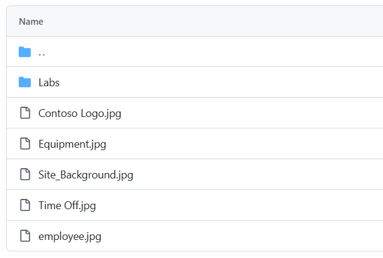

---
lab:
  title: '랩 0: 랩 환경 유효성 검사'
  module: 'Module 0: Course Introduction'
---

# 연습 랩 0 - 랩 환경 유효성 검사

> **중요:** 이 랩에서는 이 과정에서 사용할 Power Platform 애플리케이션의 Microsoft 365 테넌트 및 라이선스를 제공합니다. 이 과정에서는 연습 랩마다 하나의 테넌트만 제공됩니다. 이 테넌트 내에서 수행하는 설정 및 작업은 롤백하거나 다시 설정되지 않는 반면, 제공된 가상 머신은 랩 세션을 닫을 때마다 다시 설정됩니다. Microsoft 365 및 Power Platform은 항상 진화하고 있다는 점에 유의해 주세요. 문서의 지침은 실제 테넌트에서 경험할 내용과 다를 수 있습니다. 가상 머신이 네트워크 연결을 통해 랩을 시작하기까지 몇 분 정도 지연이 발생할 수도 있습니다.

## WWL 테넌트 - 사용 약관

강사 진행 교육 제공의 일부로 테넌트를 제공하는 경우, 강사 진행 교육에서 실습 랩을 지원하기 위해 테넌트를 사용할 수 있습니다.

테넌트를 실습 랩 외부에서 공유하거나 사용해서는 안 됩니다. 이 과정에서 사용되는 테넌트는 평가판 테넌트이며 클래스가 종료된 후 사용하거나 액세스할 수 없으며 확장판에서도 사용할 수 없습니다.

테넌트를 유료 구독으로 변환해서는 안 됩니다. 이 과정의 일부로 얻은 테넌트는 Microsoft Corporation의 재산으로 유지되며 언제든지 액세스 권한을 획득하고 다시 소유할 수 있는 권리를 보유합니다.

## 연습 1: Microsoft Power Platform에 액세스

이 연습에서는 Power Apps에 액세스할 수 있는지 확인합니다.

### 작업 1.1 – Power Apps에 로그인

1. 공인 랩 주최자로부터 **Microsoft 365 자격 증명**을 사용할 수 있는지 확인합니다. 자격 증명은 **리소스** 탭에 있습니다.

1. 새 브라우저 탭에서 `https://powerapps.microsoft.com`으로 이동합니다.

1. **로그인**을 선택합니다.

1. 공인된 랩 호스트가 제공한 메일 주소를 입력하세요.

1. **다음**을 선택합니다.

1. 공인된 랩 호스트가 제공한 암호를 입력하세요.

1. **로그인**을 선택합니다.

1. 원하는 경우 로그인 상태를 유지하려면 **예**를 선택합니다.

1. **Microsoft Edge에 로그인**하라는 프롬프트가 표시되면 **아니요**를 선택합니다.

1. 연락처 정보를 입력하라는 프롬프트가 표시되면 국가/지역을 기본값으로 두고 전화번호에 `0123456789`를 입력하고, **제출**을 선택합니다.

1. 화면 오른쪽 상단에서 **환경**이 **Dev One**으로 설정되어 있는지 확인하세요. 이 연습에서는 전체 과정 동안 이 환경에서 작업하게 됩니다. Dev One으로 설정되어 있지 않다면, **Dev One** 환경을 선택하세요.

    

1. **환경 선택** 창을 닫습니다.

### 작업 1.2 – 브라우저 업데이트

브라우저에 최신 업데이트를 적용하면 앱을 빌드할 때 다음 랩에서 문제가 발생하는 것을 방지할 수 있습니다.

1. **Microsoft Edge** 브라우저를 엽니다.

1. 브라우저 오른쪽 상단의 **명령(...)** 을 선택하고, **도움말 및 피드백**을 선택한 다음, **Microsoft Edge 정보**를 선택합니다.

1. 업데이트를 적용하고, 필요한 경우 브라우저를 다시 시작하세요.

## 연습 2: 이미지 다운로드

1. 테넌트에서 브라우저 창을 열고 https://github.com/MicrosoftLearning/PL-900-Microsoft-Power-Platform-Fundamentals/tree/master/Allfiles를 입력하세요.
2. 스크린샷에 이미지가 표시됩니다.

3. 각 이미지를 개별적으로 열고 **다운로드** 아이콘을 선택하여 다운로드하세요.

