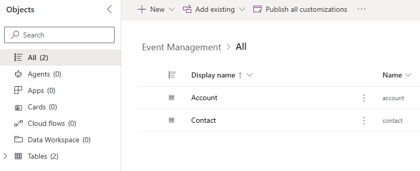

---
lab:
  title: '랩 1: 솔루션 만들기'
  learning path: 'Learning Path: Manage the Microsoft Power Platform environment'
  module: 'Module 1: Describe Microsoft Dataverse'
---

## 학습 목표

이 연습에서는 사용자가 빌드한 다양한 구성 요소를 저장할 Power Platform 솔루션을 만듭니다. Power Platform에서 솔루션은 다양한 구성 요소를 함께 그룹화하고 전송 가능성을 제공하는 데 사용됩니다. 이 연습에서 만든 솔루션은 과정의 나머지 부분 전체에서 사용됩니다.

### 시나리오

Contoso Consulting은 IT 및 AI 컨설팅 서비스를 전문으로 하는 전문 서비스 조직입니다. 일년 내내 고객에게 다양한 이벤트를 제공합니다. 이들 중 일부는 많은 파트너가 참여해 새로운 제품, 시장 동향, 서비스에 대한 세부 정보를 제공하는 무역 박람회 스타일의 이벤트입니다. 일부 이벤트는 1년 내내 수시로 진행되며, 개별 제품에 대한 세부 정보를 제공하기 위한 짧은 웨비나 형식으로 제공됩니다.

Contoso는 Power Platform을 사용하여 일년 내내 호스트하는 다양한 이벤트를 관리하는 데 사용할 수 있는 이벤트 관리 솔루션을 빌드하고자 합니다.

이 연습에서는 애플리케이션 수명 주기 관리에 사용할 솔루션을 만들 예정입니다. 이 솔루션은 우리가 함께 만드는 다양한 앱, 사이트, 흐름을 그룹화하여 쉽게 관리하고 전송할 수 있도록 해 줍니다.

이 연습을 완료하는 데 걸리는 예상 시간은 **15~20**분입니다.

이 연습을 성공적으로 완료하면 다음을 수행하게 됩니다.

- 이벤트 관리 솔루션 만들기
- 기존 계정 및 연락처 테이블을 솔루션에 추가합니다.
- 솔루션 내에서 이벤트라는 새 테이블을 만듭니다.

## 작업 1: 이벤트 관리 솔루션 만들기

1.  [Power Apps Maker Portal](https://make.powerapps.com)을 엽니다.
2.  **솔루션**으로 이동하세요.
3.  명령 모음에서 **+새 솔루션**을 선택합니다.
4.  새로운 솔루션 화면에서 다음과 같이 구성합니다.
    - **표시 이름**: 이벤트 관리
    - **이름:** 이벤트 관리
5.  **게시자**에서 **+ 새 게시자**를 선택하세요.
6.  다음과 같이 새 게시자 구성
    - **표시 이름:** EventMSLEventMSLearnarn
    - **이름:** EverntMSLearn
    - **접두사:** mslearn
    - **선택 값 접두사:** 기본값을 그대로 둡니다.

7.  **저장** 단추를 선택하여 게시자를 저장합니다.
8.  **게시자** 필드에서 방금 만든 **EventMSlearn** 게시자를 선택합니다.
9.  **기본 설정 솔루션으로 설정**을 선택하세요.

10.  **만들기**를 실행합니다.

## 작업 2: 솔루션에 기존 구성 요소를 추가하세요.

이제 구성 요소를 저장하기 위한 솔루션을 만들었으므로 여기에 일부 기존 테이블을 추가해 보겠습니다. 다양한 이벤트 관리 앱, 흐름, 사이트에서 쉽게 사용할 수 있도록 계정 및 연락처 테이블을 추가하려고 합니다. 먼저 솔루션에 계정 테이블을 추가하세요.

1.  필요한 경우 이전 작업에서 만든 **이벤트 관리** 솔루션으로 이동하세요.
2.  **명령 모음**에서 **기존 항목 추가**를 선택하세요.
3.  표시되는 메뉴에서 **테이블**을 선택하세요.
4.  **계정** 테이블을 선택한 후, **다음**을 선택합니다.
5.  **테이블 선택** 화면에서 **모든 개체 포함**을 선택합니다.
6.  **추가** 선택

이제 계정 테이블이 있으니 연락처 테이블을 추가하겠습니다.

7.  **명령 모음**에서 **기존 항목 추가** 단추를 다시 선택**하세요.**
8.  표시되는 메뉴에서 **테이블**을 선택하세요.
9.  **연락처** 테이블을 선택한 후, **다음**을 선택합니다.
10.  **테이블 선택** 화면에서 **모든 개체 포함**을 선택합니다.
11.  **추가** 선택

축하합니다. Microsoft Power Platform을 사용하여 새로운 솔루션을 성공적으로 만들었습니다. 이 솔루션을 계속해서 사용하여 추가 구성 요소를 추가하고자 합니다.
