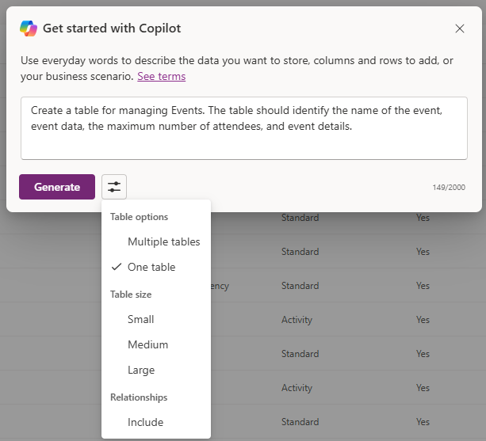
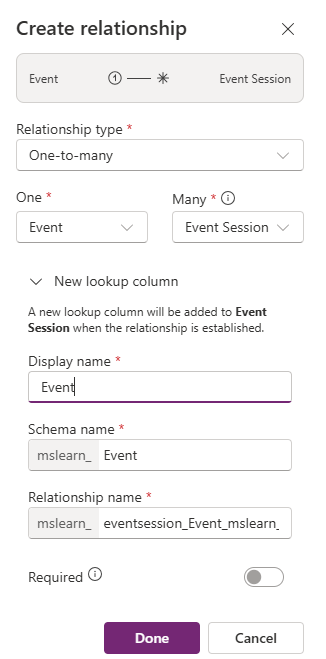
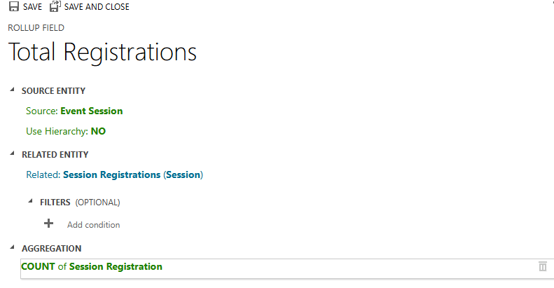

---
lab:
  title: '랩 2: 데이터 모델 만들기'
  learning path: 'Learning Path: Manage the Microsoft Power Platform environment'
  module: 'Module 1: Describe Microsoft Dataverse'
---

## 학습 목표

이 연습에서 학습자는 Copilot을 사용하여 데이터 모델을 빌드합니다. 만들고자 하는 테이블의 유형에 대한 설명을 제공하고, 디자이너를 사용하여 필요에 따라 추가 열을 추가하는 등의 변경 작업을 수행하게 됩니다.

이 랩을 성공적으로 완료하면 다음을 수행할 수 있습니다.

- Copilot을 사용하면 데이터 모델을 만드는 데 도움을 받아보세요.
- 테이블에 열을 추가하고 편집합니다.

### 시나리오

Contoso Consulting은 IT 및 AI 컨설팅 서비스를 전문으로 하는 전문 서비스 조직입니다. 일년 내내 고객에게 다양한 이벤트를 제공합니다. 이들 중 일부는 많은 파트너가 참여해 새로운 제품, 시장 동향, 서비스에 대한 세부 정보를 제공하는 무역 박람회 스타일의 이벤트입니다. 일부 이벤트는 1년 내내 수시로 진행되며, 개별 제품에 대한 세부 정보를 제공하기 위한 짧은 웨비나 형식으로 제공됩니다.

Contoso는 Power Platform을 사용하여 일년 내내 호스트하는 다양한 이벤트를 관리하는 데 사용할 수 있는 이벤트 관리 솔루션을 빌드하고자 합니다. 또한, Contoso는 직원 장비 체크 아웃 프로그램을 지원하는 몇 가지 애플리케이션을 구축하려고 합니다. 

이 연습에서는 Contoso가 이벤트를 효과적으로 관리하는 데 필요한 다양한 유형의 이벤트, 이벤트 등록 및 기타 데이터를 저장하는 데 사용되는 데이터 모드를 만들어 보려고 합니다. 다른 애플리케이션에서 사용할 장비 테이블도 만들어 보겠습니다.  

### 랩 세부 정보

이 연습을 시작하기 전에 다음 사항을 완료하는 것이 좋습니다.

- **랩 1 – 솔루션 만들기**

> **중요:** 이 랩에서는 AI를 사용하여 구성 요소를 빌드합니다. AI 결과는 다양하게 나타날 수 있으므로, 사용자의 결과는 랩에서 정의된 결과와는 다를 수 있지만 유사한 결과가 나올 수 있다는 점을 유의해야 합니다. 랩에서 설명된 기본 개념은 무엇을 만들든, 어떤 이름을 붙이든 관계없이 동일합니다. 테이블과 열이 정확히 일치하지 않더라도, 생성된 항목에 맞게 조정이 필요할 수 있습니다.

### 랩 시간

이 연습을 완료하는 데 걸리는 예상 시간은 **30~45**분입니다.

> **참고:** 이전 랩에서는 이벤트 관리 솔루션을 만들고 이 환경에서 기본 설정 솔루션으로 설정했습니다. 그러한 이유로 데이터 모델을 만들기 위해 솔루션으로 직접 이동할 필요는 없습니다. 만든 항목은 자동으로 솔루션에 추가됩니다.

## 작업 1: 데이터 모델 만들기

Contoso는 현재 Dataverse 인스턴스에 기부자 연락처 정보를 저장하고 있습니다. Dataverse를 사용하여 신청 중인 보조금과 받고 있는 기부금을 추적하고자 합니다. Contoso의 향후 애플리케이션 요구를 지원하는 데 필요한 테이블을 만들어야 합니다.

1.  필요한 경우 웹 브라우저를 열고 [Power Apps](https://make.powerapps.com/) Maker Portal로 이동한 후, Microsoft 계정 자격 증명을 사용하여 로그인하세요.
2.  Power Pages 홈 화면에서 왼쪽의 탐색 메뉴를 사용하여 **테이블**을 선택합니다.
3.  **테이블**에서 **Copilot 시작하기**를 선택하세요.
4.  **Copilot에서 빌드할 테이블 설명** 화면에 다음을 입력합니다. "*이벤트 관리를 위한 테이블을 만들어줘. 테이블에 이벤트 이름, 이벤트 데이터, 위치, 최대 참석자 수, 이벤트 세부 정보가 구분되어 표시되도록 해 줘."*
5.  **생성** 단추 옆에 있는 **테이블 설정**을 선택하고 다음과 같이 구성하세요.
    - **테이블 옵션:** 하나의 테이블
    - 관계는 포함하지 **마세요**.

6.  **생성** 버튼을 선택합니다.

> **중요:** Copilot은 **단 하나**의 테이블, 즉 Events 테이블만 만들어야 합니다. 더 많은 테이블을 만든 경우, Copilot에게 삭제할 테이블의 이름을 알려서 해당 테이블을 **삭제**해야 합니다. **추가 테이블을 제거하지 못하면 다음 단계에 영향을 미칠 수 있습니다.**

**Copilot을 사용하여 데이터 모델 편집**

이제 테이블을 만들었으니, 여기에 몇 개의 열을 추가해 보겠습니다. 먼저 이벤트 유형 열을 추가하는 것부터 시작하겠습니다. 또한, 연락처가 이벤트에 참석할 예정입니다. 기존 연락처 테이블을 데이터 모델에 추가하고, 나중에 이를 이벤트 등록과 연결하려고 합니다.

7.  **다음으로 무엇을 하시겠어요?** 필드에 다음과 같이 입력하세요. "*이벤트 유형이라는 선택 열을 추가해 줘."*
8.  다음과 같은 텍스트를 입력하여 다른 열을 추가합니다. "*등록 필요라는 선택 열을 추가해 줘*"

> **중요:** 이벤트 테이블은 위의 이미지와 정확히 일치할 필요는 없지만 최소한 다음 열은 포함되어야 합니다.
- 이벤트 이름
- 이벤트 날짜
- 최대 참석자 수
- 위치
- 이벤트 유형
- 등록 필요
위에서 언급한 열이 모두 없는 경우에는 Copilot을 사용하여 데이터 모델에 추가하세요.  

다음으로, **연락처** 테이블을 데이터 모델에 추가해 보겠습니다.

9.  맨 위의 **명령 모음**에서 **+ 기존 테이블**을 선택합니다.
10.  **검색** 필드에 **연락처**를 입력하고 **선택한 항목 추가**를 선택합니다.

이벤트 유형에 따라 하나 이상의 세션이 있을 수 있습니다. 다양한 세션을 관리하려면 세션이 무엇인지, 세션과 연결된 이벤트가 무엇인지 정의해야 합니다. 다음으로, Copilot을 사용하여 이벤트 세션 테이블을 만듭니다.

11.  **다음으로 무엇을 하시겠어요?** 필드에 다음과 같이 입력하세요. "*이벤트 세션이라는 새 테이블을 추가해 줘."*

Copilot은 이벤트 세션과 이벤트 발표자라는 두 개의 테이블을 만들 가능성이 높습니다. 하지만 연락처가 발표자이므로, 이벤트 발표자 테이블은 삭제할 예정입니다.

12.  필요한 경우, **다음으로 무엇을 하시겠어요?** 필드에 다음과 같이 입력하세요. "*이벤트 발표자 테이블을 제거해 줘."*
13.  Copilot에서 다음 텍스트를 입력하세요. "*이벤트 세션 테이블에 세션 설명이라는 새 텍스트 열을 추가해 줘."*

다음으로, 세션 등록이라는 마지막 테이블을 추가하겠습니다. 이 테이블은 특정 세션에 등록하는 개인을 관리하는 데 사용됩니다.

14.  Copilot에서 다음 텍스트를 입력하세요. *"세션 등록이라는 새 테이블을 추가해 줘."*

Copilot은 세션 등록, 세션, 참가자(또는 다른 항목) 등의 두 개의 테이블을 만들 가능성이 높습니다. 연락처는 참가자가 될 수 있으므로 참가자 테이블을 제거하겠습니다. 세션 등록 이외의 다른 테이블(예: 세션 또는 다른 테이블)을 만든 경우, 해당 테이블을 제거합니다.

15.  Copilot에서 다음 텍스트를 입력하세요. "*참가자 테이블을 제거해 줘."*
    
경우에 따라 세션 등록 테이블에 참가자 이름 열이 추가됩니다. 나중에 데이터 모델을 저장하려고 할 때 문제가 발생할 수 있으므로 이 부분을 제거해야 합니다. (나중에 다른 참가자 열로 바꿀 예정입니다.)  

16. 필요한 경우, Copilot에서 다음 텍스트를 입력하세요. "세션 등록 테이블에서 참가자 이름 열을 제거해 줘."

17. 이제 기본 열 필드가 보인다면, 다음 텍스트를 입력하세요. *기본 열 이름을 등록 이름으로 바꿔줘.*

18.  Copilot에서 다음 텍스트를 입력하세요. "*세션 등록 테이블에 특별 지침이라는 텍스트 열을 추가해 줘."*

완료된 세션 등록 테이블은 아래 이미지와 유사해야 합니다.

> **중요** 정확히 일치할 필요는 없지만, 열 이름이 참가자인 열은 없어야 하며, 최소한 다음 열들은 반드시 포함되어야 합니다.
- 등록 이름
- 세션 날짜
- 특별 지침

이제 서로 다른 테이블 간의 관계를 만들어 보겠습니다. 연락처 레코드는 세션에서 발표자가 될 수 있으므로 연락처 테이블과 이벤트 세션 테이블 간에 관계를 만들겠습니다.

18.  명령 모음에서 **관계 만들기**를 선택합니다.
19.  다음과 같이 관계를 구성합니다.
- **관계 종류:** 일대다
- **일대:** 연락처
- **다수:** 이벤트 세션
- **표시 이름:** 발표자
20.  **완료**를 선택합니다.

연락처는 세션 내 세션에 등록될 수 있으므로, 연락처 테이블과 세션 등록 테이블 간에 관계를 만들어 보겠습니다.

21.  **명령 모음**에서 **관계 만들기**를 선택합니다.
22.  다음과 같이 관계를 구성합니다.
- **관계 종류:** 일대다
- **일대:** 연락처
- **다수:** 세션 등록
- **표시 이름:** 참가자

23.  **완료**를 선택합니다.

하나의 이벤트에는 여러 개의 세션이 연결될 수 있으므로 이벤트 테이블 및 이벤트 세션 테이블 간에 관계를 만들겠습니다.

24.  **명령 모음**에서 **관계 만들기**를 선택합니다.
25.  다음과 같이 관계를 구성합니다.
- **관계 종류:** 일대다
- **일대:** Event
- **다수:** 이벤트 세션
- **표시 이름:** Event

26. **완료**를 선택합니다.

마지막으로, 참가자는 이벤트 세션에 등록하므로 이벤트 세션 테이블과 세션 등록 테이블 간에 관계를 만들어야 합니다.

27.  **명령 모음**에서 **관계 만들기**를 선택합니다.
28.  다음과 같이 관계를 구성합니다.
- **관계 종류:** 일대다
- **일대:** 이벤트 세션
- **다수:** 세션 등록
- **표시 이름:** 이벤트 세션

29.  **완료**를 선택합니다.

새로 만든 데이터 모델은 다음의 이미지와 유사해야 합니다.

30.  **저장 후 종료**를 선택합니다.

## 작업 2: 테이블 및 열 직접 편집

Copilot은 테이블과 열을 매우 빠르게 만들 수 있는 훌륭한 방법입니다. 하지만 테이블과 열을 직접 수정해야 하는 경우가 있을 수도 있습니다. 예를 들어, 이번 작업에서는 기존 열 일부를 수정하고, 특정 세션에 등록된 참가자 수를 추적할 수 있도록 할 예정입니다.

1.  필요한 경우 웹 브라우저를 열고 [Power Apps](https://make.powerapps.com/) Maker Portal로 이동한 후, Microsoft 계정 자격 증명을 사용하여 로그인하세요.
2.  왼쪽 탐색 영역에서 **테이블**을 선택합니다.
3.  **검색** 필드에서 **이벤트**를 입력하세요.
4.  **이벤트** 테이블을 여세요.
5.  **스키마** 제목 아래에서 **열**을 선택하세요.
6.  **이벤트 유형** 열을 찾아 여세요.
7.  레이블을 다음 항목으로 바꾸세요.
    - 전화 회의
    - 무역 박람회
    - 웹 세미나
    - 점심 식사 및 학습
    - 실행
8.  **기본 선택**을 **없음**으로 설정합니다.

9.  **저장** 단추를 선택합니다. (*열이 처음에 저장되지 않으면 다시 시도해 보세요.*)

다음으로, **이벤트 세션** 테이블에 새 열을 추가하여 총 세션 등록 수를 추적합니다.

10.  왼쪽의 탐색 기능에서 **테이블**을 선택하여 **이벤트** 테이블을 종료합니다.
11.  **검색** 필드에서 **이벤트**를 입력하세요.
12.  **이벤트 세션** 테이블을 엽니다.
13.  **스키마** 제목 아래에서 **열**을 선택하세요.
14.  명령 모음에서 **새 열** 단추를 선택합니다.
15.  다음과 같이 새 열을 구성합니다.
    - **표시 이름**: 총 등록 수
    - **데이터 형식:** 정수
    - **동작**: 롤업

16.  **저장 및 편집**을 선택하세요.

> **중요:** 팝업 차단 기능이 켜져 있는 경우, 롤업 필드가 표시되도록 하려면 팝업 차단 기능을 꺼야 할 수도 있습니다.

17.  다음과 같이 롤업 열을 구성합니다.
- **관련 엔터티**에서 **관련 엔터티 추가**를 선택하세요.
- **세션 등록** 테이블을 선택하세요.
- **변경 내용 저장** 단추(*확인 표시*)를 선택하세요.
- **집계** 아래에서 **집계 추가**를 선택하세요.
- **집계 함수** 아래에서 **개수**를 선택하세요.
- **집계된 관련 엔터티** 필드에서 **세션 등록**을 선택하세요.
- **변경 내용 저장** 단추 *(확인 표시)* 를 선택하세요.

18.  **저장 후 닫기** 단추를 선택합니다.

이벤트 관리 애플리케이션을 지원하는 데 사용될 데이터 모델을 성공적으로 만들었습니다. 

## 작업 3: 장비 테이블 만들기

Contoso는 이벤트를 관리하는 것 외에도 직원 장비 체크 아웃 프로그램을 운영하고 있습니다.  다음으로, 장비 정보를 저장할 테이블을 만들어 보겠습니다. 
1.  왼쪽 탐색 영역에서 **테이블**을 선택합니다.
2.  **테이블**에서 **Copilot 시작하기**를 선택하세요.
3.  **Copilot에서 빌드할 테이블 설명** 화면에 다음을 입력합니다. *"장비를 체크 아웃하기 위한 테이블을 만들어 줘. 테이블에 장비 이름, 기한, 부품 번호 포함되도록 만들어야 해."*
4.  **생성** 단추 옆에 있는 **테이블 설정**을 선택하고 다음과 같이 구성하세요.
- **테이블 옵션:** 하나의 테이블
- 관계는 포함하지 **마세요**.

5. **생성** 버튼을 선택합니다.

> **중요:** Copilot은 단 하나의 테이블, 즉 **장비 체크 아웃** 테이블만 만들어야 합니다. 더 많은 테이블을 만든 경우, Copilot에게 삭제할 테이블의 이름을 알려서 해당 테이블을 삭제할 수 있습니다.

**Copilot을 사용하여 데이터 모델 편집**

이제 테이블을 만들었으니, 여기에 몇 개의 열을 추가해 보겠습니다. 먼저 이벤트 유형 열을 추가하는 것부터 시작하겠습니다. 또한, 연락처가 이벤트에 참석할 예정입니다. 기존 연락처 테이블을 데이터 모델에 추가하고, 나중에 이를 이벤트 등록과 연결하려고 합니다.
6.  **다음으로 무엇을 하시겠어요?** 필드에 다음과 같이 입력하세요. *"테이블 이름을 장비로 바꿔줘."*
7.  **다음으로 무엇을 하시겠어요?** 필드에 다음과 같이 입력하세요. *"장비 유형이라는 선택 열을 추가해 줘."*
8.  다음과 같은 텍스트를 입력하여 다른 열을 추가합니다. *"범주라는 텍스트 열을 추가해 줘"*
9.  다음과 같은 텍스트를 입력하여 다른 열을 추가합니다. *"상태라는 텍스트 열을 추가해 줘"*

완료된 테이블은 아래 이미지와 유사합니다.

10. 테이블에 추가 열이 포함된 경우, *"[열 이름] 열을 삭제해 줘"* 를 입력하여 해당 열을 제거합니다.
11. 테이블이 이미지와 일치하면 **저장 후 종료**를 선택합니다.

## 작업 4: 장비 테이블을 직접 수정합니다.

1.  필요한 경우 웹 브라우저를 열고 Power Apps Maker Portal로 이동한 후, Microsoft 계정 자격 증명을 사용하여 로그인하세요.
2.  왼쪽 탐색 영역에서 **테이블**을 선택합니다.
3.  **검색** 필드에서 **장비**를 입력하세요.
4.  **장비** 테이블을 엽니다.
5.  **스키마** 제목 아래에서 **열**을 선택하세요.
6.  **장비 유형** 열을 찾아 여세요.
7.  필요한 경우, 레이블을 다음 항목으로 바꾸세요.
- 전자
- 가구
- 도구
- Accessories
8.  **기본 선택**을 **없음**으로 설정합니다.

9.  저장 단추를 선택합니다. (열이 처음에 저장되지 않으면 다시 시도해 보세요.)

축하합니다. Microsoft Dataverse에서 데이터 모델을 성공적으로 만들었습니다.

