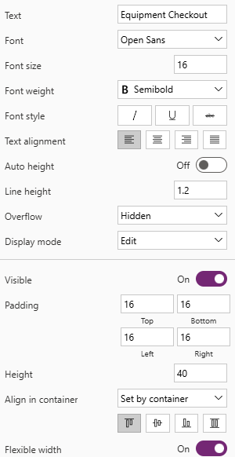

---
lab:
  title: '랩 4: 캔버스 앱 만들기'
  learning path: 'Learning Path: Demonstrate the capabilities of Microsoft Power Apps'
  module: 'Module 2: Build a canvas app'
---
## 학습 목표

이 연습에서는 Copilot을 사용하여 직원이 휴가와 장비 체크 아웃 요청을 요청하고 관리하는 데 사용할 수 있는 캔버스 애플리케이션을 만듭니다. 앱을 만든 후에는 Copilot과 Power Apps Designer를 사용하여 앱을 수정합니다.

이 랩을 성공적으로 완료하면 다음을 수행할 수 있습니다.

- Copilot을 활용하면 앱을 지원하는 데이터 모델을 만드는 데 도움이 됩니다.
- 캔버스 애플리케이션을 수정해 보세요.

### 시나리오

Contoso Consulting은 IT 및 AI 컨설팅 서비스를 전문으로 하는 전문 서비스 조직입니다. 직원들이 휴가를 신청하는 데 사용할 수 있는 휴가 신청 애플리케이션을 만들려고 합니다.

### 랩 세부 정보

이 연습을 시작하기 전에 다음 랩을 완료해야 합니다.

- **랩 2 – 데이터 모델 만들기**

> **중요** 이 랩에서는 AI를 사용하여 구성 요소를 빌드합니다. AI 결과는 다양하게 나타날 수 있으므로, 사용자의 결과는 랩에서 정의된 결과와는 다를 수 있지만 유사한 결과가 나올 수 있다는 점을 유의해야 합니다. 랩에서 설명된 기본 개념은 무엇을 만들든, 어떤 이름을 붙이든 관계없이 동일합니다. 테이블과 열이 정확히 일치하지 않더라도, 생성된 항목에 맞게 조정이 필요할 수 있습니다.*

이 연습을 완료하는 데 걸리는 예상 시간은 **60~75**분입니다.

## 작업 1: Power Apps에 로그인하여 인터페이스 탐색

1.  웹 브라우저에서 [Power Apps](https://make.powerapps.com/) Maker Portal로 이동합니다.
2.  왼쪽 탐색 영역에서 **만들기**를 선택합니다.
3.  **앱 만들기**에서 **Copilot으로 시작**을 선택하세요.
4.  **Copilot에서 빌드할 테이블 설명** 화면에 다음을 입력합니다. "직원이 보낸 휴가 요청을 저장하고 싶어. 테이블에는 요청 시작 시간과 종료 시간이 구분되어 있으면 좋겠어."
5.  **테이블 옵션** 단추를 선택하세요. 표시되는 메뉴에서 **한 테이블**을 선택하세요.

6.  **생성** 버튼을 선택합니다.

Copilot이 **휴가 요청** 테이블을 생성했어야 합니다. 다음으로, 이 테이블에 추가 열을 더 만들어 보겠습니다.

7.  **Copilot** 창에서 다음을 입력합니다. *"휴가 사유라는 선택 열을 추가해 줘."*
8.  **Copilot** 창에서 다음 프롬프트를 개별적으로 추가합니다.
    - *"휴가 유형이라는 선택 열을 추가해 줘."*
    - *"제출 날짜라는 날짜 열을 추가해 줘."*
    - *"휴가 요청 테이블에 승인 상태라는 선택 열을 추가해 줘."*
    - *"요청 세부 정보라는 여러 줄의 텍스트 열을 추가해 줘."*

    휴가 테이블은 다음 이미지와 유사해야 합니다.

다음으로, 특정 사용자와 휴가 요청을 연결시킬 수 있도록 데이터 모델에 사용자 테이블을 추가해 보겠습니다.

9.  **명령 모음**에서 **+ 기존 테이블**을 선택하세요.
10.  **추천**에서 **모든 테이블**로 전환하세요.
11.  **검색** 필드에 **사용자**를 입력합니다.
12.  **사용자** 테이블을 선택하고 **선택 항목 추가** 단추를 클릭하세요.
13.  **명령 모음**에서 **관계 만들기**를 선택합니다.
14.  다음과 같이 관계를 구성합니다.

-   **일대:** 사용자
-   **다수:** 휴가 요청
-   **표시 이름**: 직원 요청
  
15.  **완료**를 선택합니다.

완료된 데이터 모델은 다음의 이미지와 유사해야 합니다.

16.  **앱 저장 및 열기** 단추를 선택하세요.

> [!NOTE]
> 새로운 앱을 만드는 데 몇 분 정도 걸릴 수 있습니다.

## 작업 2: 새 앱 개인 설정

이제 새로운 앱이 만들어졌으므로, 필요에 가장 적합하도록 앱을 수정해 보겠습니다. 먼저, 시작 화면을 약간 수정해 보겠습니다.

1.  새 앱을 열고 **휴가 요청** 텍스트 위의 **이미지** 자리 표시자를 선택하세요.**.**
2.  표시되는 메뉴에서 **편집** \> **업로드**를 선택하세요.
3.  클래스 파일 폴더에서 **휴가** 이미지를 선택한 다음, **열기**를 선택하세요.
4.  다음으로, **사용자** 위의 **이미지** 자리 표시자를 선택하세요.
5.  표시되는 메뉴에서 **편집** \> **업로드**를 선택하세요.
6.  클래스 파일 폴더에서 **직원** 이미지를 선택한 다음, **열기**를 선택하세요.

다음으로, 사용자가 더 쉽게 읽을 수 있도록 이미지 크기를 조정해 보겠습니다. 또한, 각 항목에 표시되는 텍스트를 조정해 보려고 합니다.

7.  **명령 모음**에서 **속성** 단추를 선택하세요. (*편집 단추 바로 오른쪽에 있습니다.*)
8.  이전에 추가한 **휴가** 이미지를 선택하세요.
9.  **속성** 패널에서 다음과 같이 이미지를 구성합니다.
    
    -   **이미지 위치:** Fill
    -   **너비:** 300
    -   **높이:** 300
      
11.  이전 단계를 반복하여 **직원** 이미지의 **높이**와 **너비**를 **300** x **300**으로 설정합니다.
12.  **휴가 요청** 아래의 텍스트를 선택하세요.
13.  **속성** 패널에서 **텍스트** 필드를 선택하고 텍스트를 다음과 같이 변경합니다. *“휴가 요청을 만들고, 확인하고, 관리해 줘.”*
14.  **헤더**에서 **환영 화면** 텍스트를 선택하세요.
15.  오른쪽의 **속성** 창에서 **로고** 필드를 선택하세요.
16.  표시되는 메뉴에서 **업로드**를 선택하세요.
17. 클래스 파일에서 **Contoso 로고**를 선택하고 **열기**를 선택하세요.
18. **스타일** 및 테마 그룹 아래의 **속성** 패널에서 **채우기** 색상 아이콘을 선택합니다.
19. **사용자 지정** 탭을 선택합니다.
20. **Hex** 색상을 다음으로 변경합니다. **101E2B**
21. **헤더**가 여전히 선택되어 있는지 확인하고 **제목**을 **Contoso 직원 허브**로 변경하세요.
22. **명령** 모음에서 **저장** 단추를 선택하여 앱을 저장합니다.
23. **저장** 화면에서 **이름**을 **Contoso 직원 허브**로 설정하고 **저장**을 선택하세요.

앱은 이미지와 유사합니다.

## 작업 3: 앱에 새로운 화면을 추가합니다.

앱을 개발하는 도중 관리자 중 한 명이 연락하여 직원들도 이 앱을 사용하여 장비를 체크 아웃할 수 있을지 문의해 왔습니다. Contoso는 이미 Dataverse에 장비 체크 아웃 정보를 저장하고 있으므로 앱에서 해당 정보를 제공하기만 하면 됩니다.

1.  앱이 계속 열려 있는 상태에서 **Copilot** 창을 확장합니다(필요한 경우). Copilot에 다음을 입력하세요. "*장비 체크 아웃이라는 새 화면을 추가해 줘."*
2.  **보내기**를 선택합니다.
3.  해당 화면을 적용하려면 **유지** 단추를 선택하세요.
4.  **장비 체크 아웃**이라는 새 화면이 앱에 추가되었습니다.
5.  **장비 체크 아웃** 화면에서 **레이아웃 포함**을 클릭하고 **사이드바** 레이아웃을 선택하세요.
6.  **SideBarContainer**가 표시될 때까지 각각 다른 컨테이너를 확장합니다.

7.  **SidebarContainer**를 마우스 오른쪽 단추로 클릭하고 **EquipContainer1**로 이름을 바꿉니다.
8.  **EquipContainer1** 컨테이너를 선택한 상태에서 **삽입 메뉴 열기** 단추를 클릭하세요.
9.  **검색** 창에 **갤러리**를 입력하고 **세로 갤러리**를 선택합니다.
10.  표시되는 **검색** 필드에 데이터 소스를 제공하라는 메시지가 표시되면 **장비**를 입력하고 **장비** 테이블을 선택합니다.
11. 화면 왼쪽의 **트리 뷰**에서 방금 추가한 **Gallery1** 컨트롤을 선택하세요.
12. 갤러리 이름을 마우스 오른쪽 단추로 클릭하고 **이름 바꾸기**를 선택한 다음, **장비 목록**으로 이름을 바꿉니다.
13. **장비 목록** 갤러리 위에 마우스를 올려놓고, 갤러리 위에 나타나는 도구 모음에서 **레이아웃**을 선택하세요.
14. **제목 및 자막 레이아웃** 옵션을 선택하세요.
15. **장비 목록** 갤러리를 선택한 후, **속성** 창에서 다음과 같이 구성합니다.

    -   **너비:** 360
    -   **높이 조정 가능:** 켜기
    -   **최소 높이:** 287

다음으로, **Equipment List** 갤러리의 내용을 필터링하는 데 사용할 검색 컨트롤을 저장하기 위해 **EquipmentContiner1** 컨테이너에 추가 컨테이너를 추가해 보겠습니다.

16.  **트리** 뷰에서 **EquipContainer1**을 선택하세요.
17.  컨테이너 위에 마우스를 올려놓고 **Copilot** 아이콘을 선택하세요.
18.  다음 텍스트를 입력해 보세요. "*가로 컨테이너를 삽입해 줘.*"

19.  **유지** 단추를 선택하세요.
20.  **EquipContainer1** 컨테이너의 맨 아래에 새로운 컨테이너가 추가됩니다.
21.  **트리 뷰**에서 새 컨테이너를 클릭하고, 누른 채로 끌어서 **장비 목록** 갤러리 위에 놓습니다.
22.  컨테이너 이름을 **EquipSearchContainer**로 변경하세요.
23.  **EquipSearchContainer**를 선택한 후, **속성** 창에서 다음과 같이 구성합니다.
    
 -   **최소 너비:** 0
 -   **높이 조정 가능:** 끄기
 -   **높이:** 44
   
24.  **EquipSearchContainer**를 선택한 상태에서 **삽입 메뉴 열기** 단추를 선택하세요.
25. **검색** 필드에 **텍스트**를 입력하고 **텍스트 입력**을 선택합니다.
26. **텍스트 입력** 필드의 이름을 **EquipSearchInput**으로 변경합니다.
27. **EquipSearchInput**을 선택한 후, **속성** 창에서 다음과 같이 구성합니다.

    -   **기본값:** 비어 있음(없음)
    -   **힌트 텍스트:** 검색
    -   **글꼴:** Sans 열기
    -   **글꼴 크기:** 14
    -   **안쪽 여백**(아래 값은 이미 설정되어 있을 수 있습니다.)
        -   **위쪽:** 5
        -   **아래쪽:** 5
        -   **왼쪽:** 12
        -   **오른쪽:** 5
    -   **높이:** 44
    -   **너비 조정 가능:** 켜기
    -   **최소 너비:** 0

        

28. **트리 뷰**에서 **EquipSearchContainer**를 선택하세요.
29. 컨테이너 위에 마우스를 올려놓고 **Copilot** 아이콘을 선택한 다음, *"검색 아이콘 추가"* 를 입력하세요.
30. **유지**를 선택합니다.

> **참고:** Coplot이 잘못된 아이콘을 추가한 경우, 해당 아이콘을 제거하고 돋보기를 수동으로 삽입하세요.

31. **검색** 아이콘을 선택한 후, **속성** 창에서 다음과 같이 컨트롤을 구성합니다.

    -   **안쪾 여백**
        -   **위쪽:** 10
        -   **아래쪽:** 10
        -   **왼쪽:** 10
        -   **오른쪽:** 10
    -   **높이:** 44
    -   **너비:** 44

32. 왼쪽의 **트리 뷰**를 사용하여 **EquipSearchContainer**를 선택하세요.
33. **속성** 창에서 컨테이너를 다음과 같이 구성합니다.

    -   **최소 너비:** 0
    -   **높이:** 44

마지막으로, 검색 컨트롤 필드에 입력된 텍스트를 기반으로 **장비 목록** 갤러리의 데이터를 채우도록 구성하겠습니다.

34.  이전에 만든 **장비 목록** 갤러리를 선택하세요.
35.  **항목** 속성에 다음 수식을 입력하세요. 검색([@'장비'], *EquipSearchInput*.Text, '장비 이름', 카테고리)

36. **명령** 모음에서 **저장** 단추를 선택하여 앱을 저장하세요.

> **중요:** 수식을 복사하여 수식 입력줄에 입력한 경우, '장비' 및 '장비 이름'에 '' 기호가 올바르지 않을 수 있습니다. 수식 오류가 발생하는 경우, 해당 수식 오류를 삭제하고 다시 입력해 보세요.

## 작업 4: 레코드 작업을 표시하는 컨테이너를 빌드합니다.

사용자가 장비 목록에서 레코드를 선택하면 해당 레코드를 다른 컨테이너에서 열어서 선택한 레코드를 편집할 수 있도록 하려고 합니다.

1.  **MainContainer**를 선택하고 이름을 **DetailsContainer**로 바꿉니다.
2.  **DetailsContainer**에서 **삽입** 단추를 선택하세요.
3.  **검색** 필드에 **컨테이너**를 입력하고 **세로 컨테이너**를 선택합니다.
4.  마우스 오른쪽 단추로 클릭하고 컨테이너의 이름을 **RecordDetails**로 **바꿉니다**.
5.  **RecordDetails** 컨테이너에서 **삽입** 단추를 선택하세요.
6.  **삽입** 메뉴에서 **양식 편집**을 선택하세요.
7.  데이터 원본 선택 화면에서 **장비**를 선택합니다. *(데이터가 채워지려면 최대 30초가 걸릴 수 있습니다.)*
8.  방금 추가한 양식을 마우스 오른쪽 단추로 클릭하고 **이름을 **EquipmentForm**으로 변경합니다.**
9.  **속성** 창에서 **고급** 탭을 선택하고 **항목** 속성을 다음과 같이 설정합니다. *'장비 목록'* 이 선택되었습니다. *(이렇게 하면 현재 선택된 레코드로 양식이 채워집니다.)*
10. **표시** 탭을 선택하고 다음과 같이 양식을 구성합니다.

    -   **열:** 2
    -   **기본 모드:** 편집

이제 양식의 작업을 제어하는 데 사용될 또 다른 컨테이너를 추가해 보겠습니다.

11.  **DetailsContainer**가 선택되어 있는지 확인하세요.
12.  표시되는 **Copilot** 아이콘을 선택하세요. 다음을 입력합니다. *"가로 컨테이너를 삽입해 줘."*
13.  **유지**를 선택합니다.
14.  컨테이너를 마우스 오른쪽 단추로 클릭하고 **SelectedRecord1**로 **이름을 바꿉니다**.
15.  **트리** 뷰를 사용하여 **SelectedRecord1** 컨테이너를 **RecordDetails** 컨테이너 위로 이동합니다.
16.  다음과 같이 **SelectedRecord1** 컨테이너를 구성합니다.
    
-   **최소 너비:** 250
-   **높이 조정 가능:** 끄기
-   **높이:** 50
    
18.  **SelectedRecord1** 컨테이너를 선택한 상태에서 **삽입** 단추를 선택하세요.
19.  **텍스트 레이블**을 선택하세요.
20.  레이블의 이름을 **SelectedRecordTitle**로 바꾸세요.
21. **SelectedRecordTitle**을 다음과 같이 구성하세요.

    1.  **안쪾 여백**
        1.  **위쪽:** 5
        2.  **아래쪽:** 5
        3.  **왼쪽:** 30
        4.  **높이:** 40
    2.  **너비 조정 가능:** 켜기
    3.  **최소 너비:** 150
       
23. **SecondRecord1** 컨테이너를 선택하고 **삽입** 단추를 선택하세요.
24. **검색** 필드에 **저장**을 입력하고 **저장** 아이콘을 선택하세요.
25. 다음과 같이 **저장** 단추를 구성하세요.

    -   **높이:** 40
    -   **너비:** 40
      
27. **OnSelect** 속성을 선택하고 다음 수식을 입력합니다. SubmitForm(EquipmentForm).

## 작업 5: 페이지의 헤더 수정

이 화면을 만드는 마지막 단계는 reader 컨테이너에 데이터를 채우는 것입니다.

1.  앱 상단에서 **HeaderContainer**를 선택하세요.
2.  **삽입** 단추를 선택하세요.
3.  **텍스트 레이블**을 선택합니다.
4.  **텍스트 레이블** 컨트롤을 다음과 같이 구성하세요.
   
    -   **텍스트:** 장비 체크 아웃
    -   **글꼴:** Sans 열기
    -   **글꼴 크기:** 16
    -   **글꼴 두께:** 약간 굵게
        -   **안쪽 여백:** 16
        -   **아래쪽:** 16
        -   **왼쪽:** 16
        -   **오른쪽:** 16
    -   **높이:** 40
    -   **너비 조정 가능:** 켜기

        

6.  **HeaderContainer**를 선택하고, **삽입**을 선택한 다음, **홈 아이콘**을 선택합니다.
7.  홈 단추의 **OnSelect** 속성을 다음과 같이 설정합니다. 뒤로()

## 작업 6: 시작 화면 구성 완료

검토 결과, 이 앱에서 사용자를 생성하는 기능은 필요하지 않다고 판단하였습니다. 장비 체크 아웃에 액세스할 수 있도록 시작 화면을 변경하기로 했습니다.

7.  **트리 뷰**를 사용하여 **시작 화면**을 선택하세요.
8.  **사용자** 위의 **이미지**를 선택하세요.
9.  표시되는 메뉴에서 **편집**을 선택하고 **업로드**를 선택합니다.
10.  학생 폴더에서 **장비** 이미지를 찾아 **열기**를 선택하세요.
11.  이미지의 **OnSelect** 속성을 다음과 같이 설정합니다. 탐색(*'장비 체크 아웃'*)
12.  **사용자** 텍스트를 선택하고 **텍스트** 속성을 **장비**로 설정합니다.
13.  **장비** 아래의 **텍스트**를 선택하고 **텍스트** 속성을 다음과 같이 변경합니다. 장비를 확인하고 예약을 편집하세요.

14. **저장** 단추를 선택하여 앱을 저장하세요.

## 작업 7: 애플리케이션 테스트

1.  **명령 모음**에서 **재생** 단추를 선택하세요.
2.  **장비** 이미지를 선택하세요.
3.  **검색** 필드에 **전자 제품**을 입력하세요. (*목록이 필터링되는 방식에 주목*)
4.  **노트북** 레코드를 선택하세요.
5.  **카테고리**를 **가구**로 변경하세요.
6.  **저장** 단추를 선택합니다.
7.  **노트북** 카테고리가 **가구**로 변경되는 것을 확인할 수 있습니다.
8.  **홈** 단추를 선택하세요.
9.  **미리 보기** 모드를 종료하려면 **보라색 X**를 선택하세요.

## 작업 8: 앱 저장 및 게시

**목표:** 앱을 저장하고 게시하여 웹 브라우저, 모바일 기기 또는 SharePoint나 Teams와 같은 내장 플랫폼에서 접근할 수 있도록 합니다.

1.  Power Apps Studio에서 **저장** 단추를 선택하세요.
2.  **게시** 단추를 선택합니다.
3.  **이 버전 게시**를 선택하세요.
