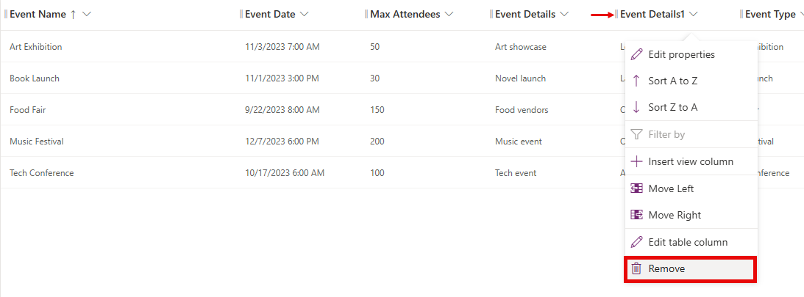
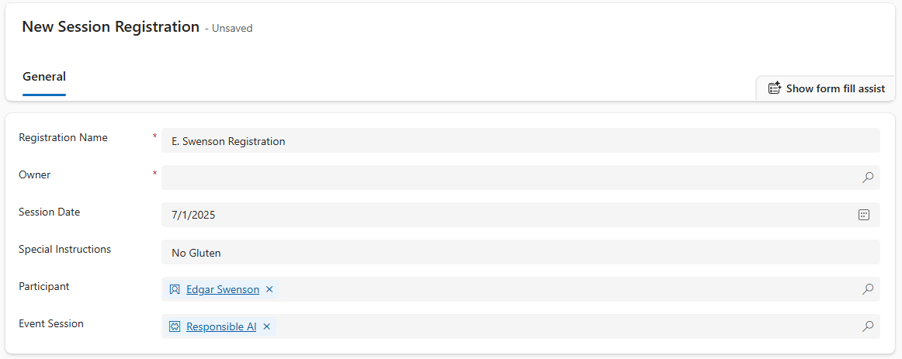

---
lab:
  title: '랩 5: 모델 기반 앱 만들기'
  learning path: 'Learning Path: Demonstrate the capabilities of Microsoft Power Apps'
  module: 'Module 3: Build a model-driven app'
---
## 학습 목표

이 연습에서 학습자는 Copilot을 사용하여 Power Apps에서 모델 기반 앱을 만듭니다. 데이터 모델을 정의하고, 양식과 뷰를 수정하고, 애플리케이션을 만듭니다.

**이 랩을 성공적으로 완료하면 다음을 수행할 수 있습니다.**

-   모델 기반 애플리케이션 빌드
-   사용자의 요구 사항에 가장 적합하도록 애플리케이션의 양식과 뷰를 수정합니다.
-   모델 기반 애플리케이션을 탐색합니다.

### 시나리오

Contoso Consulting은 IT 및 AI 컨설팅 서비스를 전문으로 하는 전문 서비스 조직입니다. 일년 내내 고객에게 다양한 이벤트를 제공합니다. 이들 중 일부는 많은 파트너가 참여해 새로운 제품, 시장 동향, 서비스에 대한 세부 정보를 제공하는 무역 박람회 스타일의 이벤트입니다. 일부 이벤트는 1년 내내 수시로 진행되며, 개별 제품에 대한 세부 정보를 제공하기 위한 짧은 웨비나 형식으로 제공됩니다.

Contoso는 Power Platform을 사용하여 일년 내내 호스트하는 다양한 이벤트를 관리하는 데 사용할 수 있는 이벤트 관리 솔루션을 빌드하고자 합니다.

이 연습에서는 Contoso의 이벤트를 관리하는 모델 기반 애플리케이션을 빌드해 보겠습니다. 모델 기반 애플리케이션은 기존 데이터 모델을 기반으로 하며 이벤트, 이벤트 세션, 세션 등록을 포함합니다.

### 랩 세부 정보:

이 연습을 시작하기 전에 다음 사항을 완료하는 것이 좋습니다.

-   **랩 1 – 솔루션 만들기**
-   **랩 2 – 데이터 모델 만들기**

이 연습을 완료하는 데 걸리는 예상 시간은 **20~30**분입니다.

## 작업 1: 새 모델 기반 애플리케이션을 지원하는 데이터 모델 만들기

Contoso는 현재 Dataverse 인스턴스에 연락처 정보를 저장하므로 Dataverse를 사용하여 과정 및 과정 등록을 추적하려고 합니다. 애플리케이션을 지원하는 데 필요한 테이블을 만들고 해당 데이터 모델을 기반으로 모델 기반 애플리케이션을 구축해야 합니다.

1.  필요한 경우 웹 브라우저를 열고 [Power Apps](https://make.powerapps.com/) Maker Portal로 이동한 후, Microsoft 계정 자격 증명을 사용하여 로그인하세요.
1.  왼쪽의 탐색 영역에서 **솔루션**을 선택합니다.
1.  이전에 만든 **이벤트 관리** 솔루션을 엽니다.
1.  **명령 모음**에서 **새로 만들기** \> **앱** \> **모델 기반 앱**을 선택합니다.
1.  **만들기** 섹션을 선택하세요.
    -   **이름**: `Contoso Event Management`
    -   **설명:**` Used to manage Events and Event Sessions`.
1.  **만들기** 단추를 선택합니다.
1.  **+페이지 추가** 단추를 선택하고 **Dataverse 테이블**을 선택하세요.
1.  다음 테이블을 선택합니다.
    -   연락처
    -   이벤트
    -   이벤트 세션
    -   세션 등록
1.  **탐색에 표시**가 선택되어 있는지 확인하세요.

    

1. **추가** 단추를 선택합니다.

> **참고:** Designer로 작업하는 동안 로그인하라는 메시지가 표시되는 경우가 있습니다. 로그인 화면을 취소하려면 X를 선택하세요.

## 작업 2: 요구 사항에 맞게 모델 기반 애플리케이션 편집

이제 앱이 생성되었으므로, 애플리케이션의 표시 방식을 몇 가지 변경해 보겠습니다. 사람과 이벤트라는 두 개의 그룹을 만들고자 합니다. 연락처 테이블을 사람 그룹에 두고, 모든 이벤트 테이블을 이벤트 그룹에 두도록 하겠습니다.

1.  화면 왼쪽의 **탐색**에서 **새 그룹**을 선택하세요.
1.  애플리케이션의 오른쪽에서 **속성** 패널을 확장합니다.
1.  **제목**을 **새 그룹**에서 `People`로(으로) 변경합니다.

    

1.  **사람** 그룹에서 **줄임표**를 선택하세요.
1.  **새 그룹**을 선택하세요.
1.  **속성** 창에서 그룹 이름을 **새 그룹**에서 `Events`로(으로) 변경합니다.
1.  왼쪽의 **세션 등록 보기** 위에 마우스 커서를 올려놓고 **줄임표**를 선택한 다음, **아래로 이동**을 선택하여 **세션 등록**을 **이벤트** 그룹으로 이동합니다.
1.  왼쪽의 **이벤트 세션** 위에 마우스 커서를 올려놓고 **줄임표**를 선택한 다음, **아래로 이동**을 선택하여 **이벤트 세션**을 **이벤트** 그룹으로 이동합니다.
1.  왼쪽의 **이벤트** 위에 마우스 커서를 올려놓고 **줄임표**를 선택한 다음, **아래로 이동**을 선택하여 **이벤트**를 **이벤트** 그룹으로 이동합니다.

    앱은 이미지와 유사해야 합니다.

    

## 작업 3: 모델 기반 애플리케이션에서 다양한 양식과 보기 편집

모델 기반 애플리케이션은 양식과 보기를 사용하여 UI(사용자 인터페이스)에서 사용자에게 데이터를 표시합니다. 이러한 항목을 몇 가지 변경하겠습니다.

1.  필요한 경우, Designer에서 **Contoso 이벤트 관리** 앱이 열려 있는지 확인하세요.
1.  화면 왼쪽의 **사람** 그룹에서 **연락처 양식** 위에 마우스 커서를 올려놓고 **편집**을 선택하세요.

    변경 내용을 저장하라는 프롬프트가 표시되면 **저장 후 계속**을 선택하세요.

1.  왼쪽의 **테이블 열**에서 **새 테이블 열**을 선택하세요.
1.  다음과 같이 테이블 열을 구성합니다.
    -   **표시 이름**: `Contact Type`
    -   **데이터 형식:** 선택
    -   **전역 선택과 동기화:** 아니요
1.  첫 번째 선택의 **레이블**을 **발표자**로 설정합니다.
1.  **+ 새 선택**을 선택하고 레이블을 **참가자**로 설정합니다.
1.  **+ 새 선택**을 선택하고 레이블을 **지원 직원**으로 설정합니다.

    

1.  **저장** 단추를 선택합니다.
1.  마우스를 사용하여 **새 연락처** 텍스트를 선택한 다음, 폼 머리글을 선택합니다. *(머리글 주위에 자주색 사각형이 표시되어야 합니다.)*
1. **테이블 열**의 **검색** 필드에 **연락처**를 입력하세요.
1. 방금 만든 **연락처 유형** 테이블 열을 선택하세요.
1. 이제 **연락처 유형**이 **머리글**에 나타나야 합니다.

    

1. **명령 모음** 양식에서 **저장 및 게시** 단추를 선택하세요.
1. 모델 기반 애플리케이션 디자이너로 돌아가려면 **뒤로 화살표** 단추를 선택하세요.
1. 왼쪽의 **탐색**에서 **연락처 보기** 위에 마우스 커서를 올려놓고 **편집** 아이콘을 선택하세요. (저장하라는 프롬프트가 표시되면 **저장 후 계속**을 선택하세요.)
1. **+ 열 보기**를 선택하세요.
1. **연락처 유형** 열을 검색하여 보기에 추가하세요.
1. **저장 및 게시** 단추를 선택하세요.
1. 모델 기반 애플리케이션 디자이너로 돌아가려면 **뒤로 화살표** 단추를 선택하세요.

    다음으로, 나머지 양식에 필요한 변경 내용을 적용해 보겠습니다.

1.  **탐색**에서 **이벤트 보기**를 선택하세요.
    
    여기에 **EventDetails1** 열이 있을 수 있습니다. 만약 존재한다면, 이 열을 보기에서 제거할 예정입니다. *(만약 해당 열이 없다면, ** 작업 4: 저장 및 게시로 건너뛰어도 됩니다.**)*

1.  **이벤트 보기** 위에 마우스 커서를 올려놓고 **편집** 단추를 선택하세요.

    변경 내용을 **저장**하라는 프롬프트가 표시되면 **저장 후 계속**을 선택하세요.

1.  **보기**에서 **EventDetails1** 옆에 있는 화살표를 선택하고, 표시되는 메뉴에서 **제거**를 선택하세요.

    

1.  **저장 및 게시** 단추를 선택하세요.
1.  앱 디자이너로 돌아가려면 **뒤로 화살표** 단추를 선택하세요.
1.  **탐색**에서 **이벤트** **양식** 위에 마우스 커서를 올려놓고 **편집**을 선택하세요.

    변경 내용을 저장하라는 프롬프트가 표시되면 **저장 후 계속**을 선택하세요.

1.  **이벤트 세부 정보1** 필드를 선택하고 키보드의 **Delete** 키를 누르세요.

    양식은 이미지와 유사해야 합니다.

    

    정확히 일치하지 않더라도 그림의 모든 필드가 그대로 있다면 괜찮습니다.  

1.  **저장 및 게시** 단추를 선택하세요.
1.  앱 디자이너로 돌아가려면 **뒤로 화살표** 단추를 선택하세요.

## 작업 4: 저장 후 게시(양식에 EventDetail1 필드가 없다면 여기에서 계속합니다.)

1.  앱의 **명령** 모음에서 **저장 및 게시** 단추를 선택하세요.

1.  **이벤트 관리** 솔루션으로 돌아가려면 **뒤로** 단추를 선택하세요.
1.  **솔루션으로 돌아가기** 화살표를 선택하여 기본 **Power Apps** Maker Portal로 돌아갑니다.
1.  **뒤로** 화살표를 선택하여 **Power Apps** 메인 화면으로 돌아갑니다.

## 작업 5: 새 애플리케이션 테스트

이제 모델 기반 애플리케이션이 생성되었으므로 해당 기능을 테스트해 보겠습니다.

먼저 몇 개의 연락처를 추가하겠습니다.

1.  왼쪽 탐색 영역에서 **앱**을 선택합니다.
1.  표시되는 앱을 **내 앱**에서 **모두**로 변경합니다.
1.  방금 만든 **Contoso 이벤트 관리** 애플리케이션 위에 마우스 커서를 올려놓고 **재생** 아이콘을 선택하세요.
1.  왼쪽 탐색 영역에서 **연락처**를 선택하세요.
1.  **명령** 모음에서 **+ 새로 만들기** 단추를 선택하세요.
1.  **새 연락처** 화면에서 다음과 같이 구성하세요.
    -   **이름:** `Suzanne`
    -   **성:** `Diaz`
    -   **직함:** `Engineer`
1.  폼 머리글에서 **연락처 유형** 옆에 있는 아래쪽 화살표를 선택하세요.
1.  **연락처 유형**을 **발표자**로 설정합니다.

    

1.  연락처를 저장하고 열어 두려면 **저장** 단추를 선택하세요.
1. **+ 새로 만들기** 버튼을 선택합니다.
1. **새 연락처** 화면에서 다음과 같이 구성하세요.
    -   **이름:** Edgar
    -   **성:** Swenson
    -   **직함:** 아키텍트
    -   **메일:** 메일 주소 입력(**자신**의 메일 주소를 꼭 추가하세요.)
1. 폼 머리글에서 **연락처 유형** 옆에 있는 아래쪽 화살표를 선택하세요.
1. **연락처 유형**을 **참가자**로 설정합니다.
1. **저장 후 닫기** 단추를 선택합니다.

    다음으로, 새로운 이벤트를 추가하겠습니다.

1.  왼쪽 탐색 영역에서 **이벤트**를 선택하세요.
1.  명령 모음에서 **+ 새로 만들기** 단추를 선택하세요.
1.  **새 이벤트** 화면에서 다음과 같이 구성하세요.
    - **이벤트 이름:** `Spring conference`.
    - **이벤트 날짜:** 내일 날짜
    - **최대 참석자 수:**`500`
    - **이벤트 세부 정보:** `Spring conference to showcase newest products and services from our supported vendors`.
    - **이벤트 유형:** 컨퍼런스
    - **위치**: `Seattle`
    - **등록 필요:** 예/True

    

1.  **저장 후 닫기** 단추를 선택합니다.

    다음으로, 이벤트에 대한 새 세션을 추가해 보겠습니다.

1.  왼쪽의 탐색 영역에서 **Event Sessions**를 선택합니다.
1.  **+ 새로 만들기** 버튼을 선택합니다.
1.  **이벤트 세션**을 다음과 같이 구성합니다.
    - **세션 이름:** `Responsible AI`
    - **세션 날짜:** 내일 날짜
    - **길이:** 1.5시간
    - **세션 설명:**`With all the new AI solutions, being responsible is important. We will discuss the challenges`.
    - **발표자:** `Suzanne Diaz`
    - **이벤트:** `Spring Conference`

    

1.  **저장 후 닫기** 단추를 선택합니다.

    마지막으로 **세션 등록**을 생성하겠습니다.

1.  왼쪽의 탐색을 사용하여 **세션 등록**을 선택하세요.
1.  **명령 모음**에서 **+ 새로 만들기**를 선택하세요.
1.  다음과 같이 세션 등록을 완료하세요.
    - **등록 이름:** `E, Swenson Registration`.
    - **소유자:** 있는 그대로 둡니다.
    - **등록 날짜:** 오늘 날짜
    - **특별 지침:** `No Gluten`
    - **참가자:** `Edgar Swenson`
    - **이벤트 세션:** `Responsible AI`

    

1.  **저장 후 닫기** 단추를 선택합니다.
