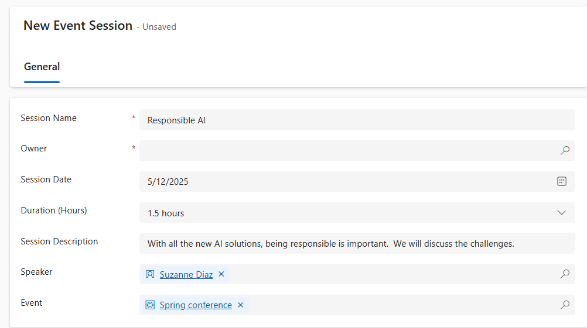

---
lab:
  title: '랩 6: Power Automate 흐름을 만듭니다.'
  learning path: 'Learning Path: Demonstrate the capabilities of Microsoft Power Automate'
  module: 'Module 2: Build a Microsoft Power Automate flow'
---

## 학습 목표

이 연습에서 학습자는 Power Automate의 Microsoft Copilot을 사용하여 다양한 클라우드 흐름 시리즈를 만들게 됩니다. Copilot 활용 및 직접 생성 등의 다양한 생성 방법을 사용해보며, 사용 가능한 옵션들을 익히게 될 것입니다.

이 연습을 성공적으로 완료하면 다음을 수행하게 됩니다.

- 자연어 프롬프트를 사용하여 워크플로 디자인
- 트리거 및 작업 구성
- 실제로 사용하기 위해 자동화를 테스트합니다.

### 시나리오

Contoso Consulting은 IT 및 AI 컨설팅 서비스를 전문으로 하는 전문 서비스 조직입니다. 일년 내내 고객에게 다양한 이벤트를 제공합니다. 이들 중 일부는 많은 파트너가 참여해 새로운 제품, 시장 동향, 서비스에 대한 세부 정보를 제공하는 무역 박람회 스타일의 이벤트입니다. 일부 이벤트는 1년 내내 수시로 진행되며, 개별 제품에 대한 세부 정보를 제공하기 위한 짧은 웨비나 형식으로 제공됩니다. 또한, Contoso는 고객의 질문에 답변하기 위해 자동화된 에이전트를 활용하기 시작했습니다.

Contoso는 Power Automate를 사용하여 이벤트에 등록할 때 고객에게 자동으로 메일을 보내는 등록 확인 흐름을 빌드하려고 합니다. 

이 연습에서는 특정 기준에 따라 일련의 Power Automate 흐름을 빌드하게 됩니다.

이 연습을 시작하기 전에 다음 랩을 완료해야 합니다.

- **랩 2 – 데이터 모델 만들기**
- **랩 5 – 모델 기반 앱 빌드**

이 연습을 완료하는 데 걸리는 예상 시간은 20~30분입니다.

## 연습 1: 세션 등록 알림 흐름 만들기

이 첫 번째 연습에서는 새 세션 등록이 생성될 때 자동으로 실행되는 흐름을 빌드해 보겠습니다. 이 흐름에서는 등록된 세션, 해당 이벤트, 등록한 연락처의 세부 정보를 가져오고, 등록 세부 정보가 포함된 메일 전송 등의 작업을 수행합니다.

### 작업 1: 흐름 만들기

새로 등록한 모든 사용자에게 등록 확인을 보내려고 합니다. 등록 세부 정보를 캡처하고 등록된 사용자에게 확인 메일을 보내는 흐름을 만들어 보겠습니다.

1. [https://make.powerautomate.com](https://make.powerautomate.com/)(으)로 이동합니다.

1. 다시 인증이 필요할 수 있습니다. 필요한 경우 **로그인**을 선택하고 지침을 따릅니다.

1. 아직 선택하지 않은 경우 오른쪽 상단에서 **Dev One** 환경을 선택합니다. (중요, 이 단계 수행을 절대 잊지 마세요.)

1. 왼쪽 탐색에서 **+ 만들기**를 선택하세요. (프롬프트가 표시되면 **시작**을 선택하세요.)

1. **자동화된 클라우드 흐름**을 선택합니다.

1. **흐름 이름**으로 `Registration Notification`를 입력합니다.

1. **흐름의 트리거 선택**에서 `Dataverse`을(를) 검색합니다.

1. **행이 추가, 수정 또는 삭제될 때** 트리거를 선택한 다음 **만들기**를 선택합니다.

    **잘못된 매개 변수** 오류가 표시된다면, 이는 인증이 완료되지 않았기 때문입니다. 아래 단계에 따라 연결을 만듭니다. 
    - **연결 변경**을 선택하세요.
    - **새로 추가**를 선택합니다.
    - **연결 이름** 필드에 MOD **관리자**를 입력하세요. **인증 유형**을 **OAuth**로 두고 **로그인**을 선택하세요.
    - 로그인 후 **9단계**로 이동하세요. 

1. 흐름에 대한 트리거 조건을 채웁니다.

    - **변경 유형**에 대해 **추가됨**을 선택합니다.
    - **테이블 이름**에 **세션 등록**을 선택하세요.
    - 트리거 단계에서 **범위**에 대한 **조직**을 선택합니다. 

1. 트리거 단계의 이름을 `When a Session Registration is added`로(으로) 바꿉니다.

    

이것은 좋은 연습이므로 사용자 및 기타 흐름 편집자는 세부 정보에 대해 자세히 살펴볼 필요 없이 이 단계의 목적을 이해할 수 있습니다.

### 작업 2: 등록 대상 이벤트 세션의 세부 정보를 얻기 위한 단계를 만듭니다.

1. **+ 새 단계**를 선택합니다. 

1. **ID로 행 가져오기**를 검색하세요. 

1. **ID 기준으로 행 가져오기** 작업을 선택합니다.

1. **테이블 이름**으로 **이벤트 세션**을 선택하세요.

1. **행 ID** 필드를 선택합니다. **동적 콘텐츠** 또는 **표현식**을 선택하기 위한 아이콘이 나타납니다.

1. **행 ID** 필드에서 **동적 콘텐츠** 목록의 **이벤트 세션(값)** 을 선택합니다. 이 단계에서는 이 흐름을 트리거하기 위해 생성된 **세션 등록**의 **이벤트 세션**을 찾습니다.

1. **ID 기준으로 행 가져오기** 작업에서 이 작업의 이름을 `Get the Event Session`로 바꿉니다.

    

    다음으로, 해당 세션이 포함된 이벤트의 세부 정보를 알아보겠습니다.

1. **이벤트 세션 가져오기** 단계에서 **+ 작업 삽입**을 선택합니다.

1. **ID로 행 가져오기**를 검색하세요. 

1. **ID 기준으로 행 가져오기** 작업을 선택합니다.

1. **테이블 이름**으로 **이벤트**를 선택하세요.

1. **행 ID** 필드를 선택합니다. **동적 콘텐츠** 또는 **표현식**을 선택하기 위한 아이콘이 나타납니다.

1. **행 ID** 필드의 **동적 콘텐츠** 목록에서 **이벤트(값)** 를 선택합니다. 이 단계에서는 이전 단계에서 캡처된 **이벤트 세션**의 **이벤트**를 찾습니다.

1. **ID 기준으로 행 가져오기** 작업에서 이 작업의 이름을 `Get the Event`로 바꿉니다.

    

    마지막으로, 세션에 등록된 사람의 세부 정보를 알아보겠습니다.

1. 이벤트 세부 정보 가져오기에서 **새 작업 삽입**을 선택하세요.

1. 검색 필드에 **ID로 행 가져오기**를 입력하세요.

1. **ID로 행 가져오기**를 선택하세요.

1. **테이블 이름**으로 **Contacts**를 선택합니다.

1. **행 ID** 필드를 선택합니다. **동적 콘텐츠** 또는 **식**을 선택하라는 팝업 창이 표시됩니다.

1. **행 ID** 필드에서 **동적 콘텐츠** 목록의 **세션 등록이 추가될 때** 트리거에서 **참가자(값)** 필드를 선택하세요.

1. **ID로 행 가져오기** 텍스트를 선택하고 이 작업의 이름을 `Get Participant Details`로(으로) 변경합니다.

    

### 작업 3: 세션 등록을 확인하기 위한 메일 전송 단계 만들기

1. **참가자 세부 정보 가져오기** 단계에서 **새 작업 삽입**을 선택합니다.

1. 검색 필드에 **메일 보내기**를 입력하세요.

1. **이메일 보내기(V2)** 를 선택합니다.

    Outlook에 대한 연결을 만들라는 프롬프트가 표시될 수 있습니다. 그럴 경우 **로그인** 단추를 선택하고 **Mod Administrator** 계정으로 로그인하세요. 

    

1. **받는 사람** 필드 바로 위에 있는 **톱니 바퀴형** 아이콘을 선택하세요. 표시되는 메뉴에서 **동적 콘텐츠 사용**을 선택하세요.

     

1. 동적 값을 사용하여 **받는 사람** 필드에서 **참가자 세부 정보 가져오기** 아래의 **메일**을 선택하세요.

    

1. **제목** 필드에 `Registration Confirmation`라고(이라고) 표시되는지 확인합니다.

1. **이메일 본문**에 다음 텍스트를 입력합니다.

    > **참고:** 필드가 괄호로 명명되는 곳에 동적 콘텐츠를 배치해야 합니다. 먼저 모든 텍스트를 복사하여 붙여넣은 다음, 올바른 위치에 동적 콘텐츠를 추가하는 것이 좋습니다.

    *`Dear {First Name}, Thank you for registering for our upcoming session {Session Name} on {Event Date}. {Speaker} will be your speaker in this session. Your session is scheduled to last {Duration (Hours)}. Check out our other session at our {Event Name}.`*

    *`Best regards,`*

    *`Events Administration`*
    
    *`Contoso Consulting`*

    이제, 대괄호 안에 있는 텍스트를 아래에 설명된 항목으로 바꾸세요.

1. **{First Name}** 텍스트를 강조 표시합니다. 이를 **참가자 세부 정보 가져오기** 단계의 **이름** 필드로 바꾸세요.

1. **{세션 이름}** 텍스트를 강조 표시합니다. 이를 **이벤트 세션 가져오기** 단계의 **세션 이름** 필드로 바꾸세요.

1. **{이벤트 날짜}** 텍스트를 강조 표시합니다. **이벤트 세부 정보 가져오기** 단계의 **이벤트 날짜** 필드로 바꾸세요.

1. **{발표자}** 텍스트를 강조 표시합니다. **이벤트 세션 가져오기** 단계의 **발표자(값)** 필드로 바꾸세요.

1. **{기간(시간)}** 텍스트를 강조 표시합니다. **이벤트 세션 가져오기** 단계의 **기간(시간)** 필드로 바꾸세요.

1. **{이벤트 이름}** 텍스트를 강조 표시합니다. **이벤트 세부 정보 가져오기** 단계의 **이벤트 이름** 필드로 바꾸세요.

    완료된 단계는 다음의 이미지와 유사해야 합니다.

    

1. **저장**을 선택합니다.

    다음 작업을 위해 이 흐름 탭을 열어 두세요. 흐름은 다음과 같아야 합니다.

### 작업 4: 몇 가지 샘플 데이터 입력

> **참고:** 랩 5 - 모델 기반 앱 구축을 완료한 경우, 이 작업을 건너뛰고 바로 작업 5로 넘어갈 수 있습니다. 

1. 왼쪽 탐색 영역에서 **앱**을 선택합니다.

1. 표시되는 앱을 **내 앱**에서 **모두**로 변경합니다.

1. **이벤트 관리** 애플리케이션 위에 마우스 커서를 올려놓고 **재생** 아이콘을 선택하세요.

1. 왼쪽 탐색 영역에서 **연락처**를 선택하세요.

1. 명령 모음에서 **+ 새로 만들기** 단추를 선택하세요.

1. **새 연락처** 화면에서 다음과 같이 구성하세요.

    - **이름:** Suzanne

    - **성:** Diaz

    - **직함:** 엔지니어

1. 폼 머리글에서 **연락처 유형** 옆에 있는 아래쪽 화살표를 선택하세요.

1. **연락처 유형**을 **발표자**로 설정합니다.
    

1. 연락처를 저장하고 열어 두려면 **저장** 단추를 선택하세요.

1. **+ 새로 만들기** 버튼을 선택합니다.

1. **새 연락처** 화면에서 다음과 같이 구성하세요.

    - **이름:** Edgar

    - **성:** Swenson

    - **직함:** 아키텍트

    - **메일:** 메일 주소 입력(중요, 흐름 실행 안 함)

1. 폼 머리글에서 **연락처 유형** 옆에 있는 아래쪽 화살표를 선택하세요.

1. **연락처 유형**을 **참가자**로 설정합니다.

1. **저장 후 닫기** 단추를 선택합니다.

    다음으로, 새로운 이벤트를 추가하겠습니다.

1. 왼쪽 탐색 영역에서 **이벤트**를 선택하세요.

1. 명령 모음에서 **+ 새로 만들기** 단추를 선택하세요.

1. **새 이벤트** 화면에서 다음과 같이 구성하세요.

    - **이벤트 이름:** 봄 컨퍼런스

    - **이벤트 날짜:** 내일 날짜

    - **최대 참석자 수:** 500

    - **이벤트 세부 정보:** 지원하는 공급업체의 최신 제품과 서비스를 소개하는 봄 컨퍼런스입니다.

    - **이벤트 유형:** 컨퍼런스

    - **위치:** 시애틀

    - **등록 필요:** 예/True

    

1. **저장 후 닫기** 단추를 선택합니다.

    다음으로, 이벤트에 대한 새 세션을 추가해 보겠습니다.

1. 왼쪽의 탐색 영역에서 **Event Sessions**를 선택합니다.

1. **+ 새로 만들기** 버튼을 선택합니다.

1. **이벤트 세션**을 다음과 같이 구성합니다.

    - **세션 이름:** 책임있는 AI

    - **세션 날짜:** 내일 날짜

    - **길이:** 1.5시간

    - **세션 설명:** 새로운 AI 솔루션들이 계속해서 등장하는 가운데, 책임감 있게 사용하는 것이 매우 중요하게 되었습니다. 이번에는 AI 활용과 관련된 주요 과제들에 대해 논의해 보겠습니다.

    - **발표자:** Suzanne Diaz

    - **이벤트:** 봄 컨퍼런스

    

1. **저장 후 닫기** 단추를 선택합니다.

 
### 작업 5: 흐름의 유효성 검사 및 테스트

1. 필요한 경우, 브라우저에서 새 탭을 열고 [https://make.powerapps.com](https://make.powerapps.com/)으로 이동하세요. 

1. 아직 선택하지 않은 경우 오른쪽 위에 있는 **Dev One** 환경을 선택합니다.

1. **앱**을 선택하고 **Contoso 이벤트 관리 앱**을 엽니다.

1. 이 브라우저 탭을 열어 두고 흐름이 있는 이전 탭으로 다시 이동합니다.

1. 명령 모음에서 **테스트**를 선택합니다. **수동**, **테스트**를 차례로 선택합니다.

1. 모델 기반 앱이 열려 있는 브라우저 탭으로 이동합니다.

    마지막으로 **세션 등록**을 생성하겠습니다.

1. 왼쪽의 탐색을 사용하여 **세션 등록**을 선택하세요.

1. **명령 모음**에서 **+ 새로 만들기**를 선택하세요.

1. 다음과 같이 세션 등록을 완료하세요.

    - **이름**: `E, Swenson Registration`.

    - **등록 날짜:** 오늘 날짜

    - **참가자:** `Edgar Swenson`

    - **세션** `Responsible AI`

    

1. **저장 후 닫기** 단추를 선택합니다.

1. 흐름 테스트가 실행되는 브라우저 탭으로 이동합니다. 잠시 후 흐름 실행을 볼 수 있습니다. 여기에서 흐름의 문제를 확인하거나 성공적으로 실행되었는지 확인할 수 있습니다.

잠시 후 받은 편지함에 이메일이 표시됩니다.

> **참고:** 정크 메일 폴더로 이동될 수 있습니다.
