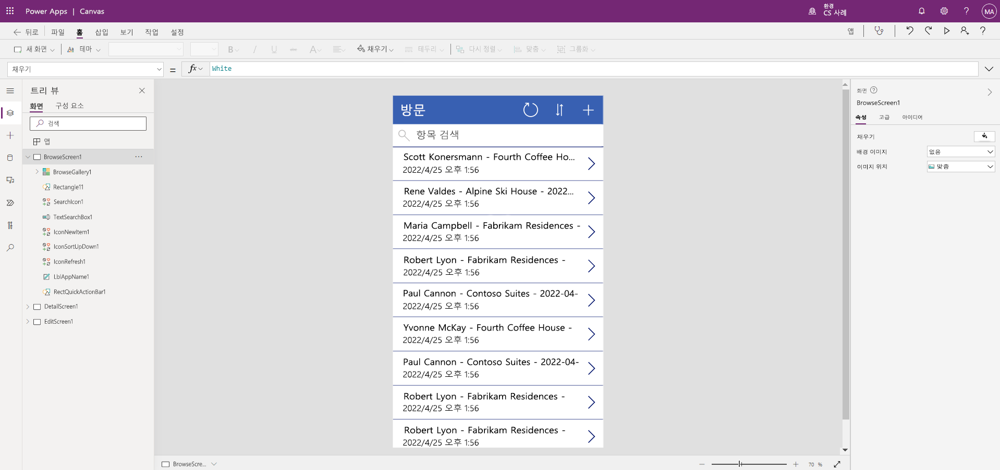

---
lab:
  title: '랩 2: 캔버스 앱 빌드 방법'
  module: 'Module 3: Get started with Power Apps'
---

# 랩 2: 캔버스 앱 빌드 방법

## 시나리오

Bellows College is an educational organization with multiple buildings on campus. Campus visits are currently recorded in paper journals. The information is not captured consistently, and there are no means to collect and analyze data about the visits across the entire campus.

Currently, campus administration is leveraging an Excel spreadsheet to track visitor registration. They would like to modernize their visitor registration system where access to the buildings is controlled by security personnel and all visits are required to be pre-registered and recorded by their hosts.

이 과정 전반에 걸쳐 벨로즈 칼리지 관리 및 보안 담당자가 캠퍼스 내 건물에 대한 액세스를 관리하고 제어할 수 있도록 애플리케이션을 빌드하고 자동화를 수행합니다.

## 고급 랩 단계

캔버스 앱을 디자인하기 위해 아래 개요를 따릅니다:

- 방문 테이블의 데이터에서 캔버스 앱 만들기

- 찾아보기 화면에 방문이 표시되는 방식 구성

- 앱에 대한 몇 가지 기본 변경

- 앱 기능 테스트

## 필수 조건

- **모듈 0 랩 0 - 랩 환경 검증** 완료
- **모듈 2 랩 1 - 데이터 모델링** 완료

## 연습 1: Visits 캔버스 앱 만들기

**목표:** 이 연습에서는 앞서 만들었던 Visits 테이블을 연결하여 캔버스 앱을 만듭니다.

### 작업 \#1: Visits 앱 만들기

1.  Navigate to <ph id="ph1">&lt;https://make.powerapps.com&gt;</ph>. You may need to reauthenticate - click <bpt id="p1">**</bpt>Sign in<ept id="p1">**</ept> and follow instructions if needed.

2.  아직 선택되지 않은 경우 오른쪽 상단에 있는 **[내 이니셜] 연습** 환경을 선택합니다.

3.  If necessary, click the <bpt id="p1">**</bpt>Home<ept id="p1">**</ept> icon on the left side of the screen. Under the <bpt id="p1">**</bpt>Start from<ept id="p1">**</ept> section, select <bpt id="p2">**</bpt>Dataverse<ept id="p2">**</ept>.

4.  Dataverse 연결을 선택합니다.

    > **참고:** Datverse 연결이 없는 경우:
    > - **새 연결**을 선택합니다.
    > - **Microsoft Dataverse**를 찾습니다.
    > - **생성**

5.  이전 랩에서 만든 **방문** 테이블을 찾아 선택합니다.

6.  오른쪽 하단에서 **연결** 버튼을 선택합니다.

7.  앱을 만든 후 Power Apps Studio 시작 화면에서 **다시 표시 안 함** 확인란을 선택한 다음 **건너뛰기**를 선택합니다.

8.  만들기가 완료되면 아래 이미지와 같이 표시됩니다.

9. Bellows College는 캠퍼스 내에 여러 건물이 있는 교육 기관입니다.

10. 화면 오른쪽 위에 있는 **X**를 선택하여 앱 미리 보기를 닫습니다.

캠퍼스 방문은 현재 종이에 기록되어 있습니다.

### 작업 \#2: 새로 만든 앱을 수정하고 테마를 정합니다.

이 작업에서는 앱의 세 화면 각각에 있는 머리글 텍스트를 사용자 지정하고(찾아보기, 세부 정보 및 편집) 앱 테마를 변경합니다.

1.  이 정보는 일관되게 수집되지 않으며, 전체 캠퍼스 방문 데이터를 수집하고 분석할 방법이 없습니다.

1.  화면 오른쪽의 속성 탭에서 **텍스트** 컨트롤 속성을 **“벨로우즈 대학 방문”** 으로 업데이트합니다.

1. 속성에서 **글꼴 크기**를 **24**로 변경합니다.

1.  화면의 빈 배경을 클릭하여 찾아보기 화면에서 업데이트된 텍스트를 확인합니다.

1.  왼쪽 탐색에서 트리 뷰를 사용하여 **DetailScreen1**을 선택합니다.

1.  화면에서 **방문** 레이블을 선택합니다.

1.  화면 오른쪽의 속성 탭에서 **텍스트** 컨트롤 속성을 **“방문 세부 정보”** 로 업데이트합니다.

1.  화면의 빈 배경을 클릭하여 세부 정보 화면에서 업데이트된 텍스트를 확인합니다.

1.  왼쪽 탐색에서 트리 뷰를 사용하여 **EditScreen1**을 선택합니다(트리 뷰에서 보려면 아래로 스크롤해야 할 수 있음).

1.  화면에서 **방문** 레이블을 선택합니다.

1.  화면 오른쪽의 속성 탭 아래에서 **텍스트** 컨트롤 속성의 Table1 텍스트를 **“세부 정보 편집”** 으로 바꿉니다.

1.  화면의 빈 배경을 클릭하여 편집 화면에서 업데이트된 텍스트를 확인합니다.

1. 왼쪽 탐색에서 트리 뷰를 사용하여 **BrowseScreen1**을 선택합니다.

1. 명령 도구 모음에서 **테마** 단추를 선택하고 나타나는 목록에서 **빨간색** 테마 색을 선택합니다.

### 작업 \#3: 방문 앱 테스트

이 작업에서는 새 앱을 테스트합니다.

1.  애플리케이션이 앱 디자이너에서 열려 있는 상태에서 **파일**을 선택하고 앱 이름을 **방문 앱**으로 업데이트하고 **저장**을 선택합니다.

2.  **뒤로** 화살표를 선택하여 앱으로 돌아갑니다.

3.  왼쪽의 탐색 영역에서 **BrowseScreen1**을 선택합니다.

4.  In the app designer, select the <bpt id="p1">**</bpt>preview the app<ept id="p1">**</ept> button (Play icon) on the command bar. <bpt id="p1">*</bpt>(You can also preview the app by pressing F5 on your keyboard.)<ept id="p1">*</ept>

4.  앱이 열리면 **검색 항목** 필드에 텍스트 **Maria**
    를 입력합니다(갤러리의 항목이 검색 필드에 입력된 항목을 기준으로 필터링하는 방법을 확인합니다).

5.  현재 캠퍼스 관리부는 방문자 등록을 추적하기 위해 Excel 스프레드시트를 활용하고 있습니다.

6.  레코드를 편집하려면 앱의 오른쪽 위 모서리에 있는 **연필 아이콘**을 선택합니다.

7.  여기에서 방문 이름을 편집하고 오른쪽 위에 있는 확인 표시 아이콘을 클릭하여 변경 내용을 저장할 수 있습니다.

8.  화면 오른쪽 위에서 **X** 아이콘을 클릭하여 캔버스 앱 편집기로 돌아갑니다.

건물 액세스가 보안 요원에 의해 제어되고, 모든 방문이 반드시 호스트에 의해 사전 등록 및 기록되는 현대화된 방문자 등록 시스템을 원합니다.

## 과제

- 다음 열을 DetailScreen1 및 EditScreen1의 양식에 추가합니다. 실제 시작, 실제 종료, 코드, 예약된 시작 및 예약된 종료