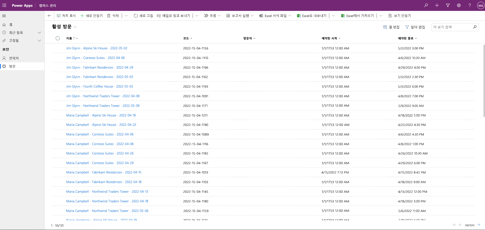

---
lab:
  title: '랩 3: 모델 기반 앱 빌드 방법'
  module: 'Module 3: Get started with Power Apps'
ms.openlocfilehash: 56a807c49479c245f95e3af9566450651bcc3ebb
ms.sourcegitcommit: 99acd470de1164d438d7c4794faa28d6489c39db
ms.translationtype: HT
ms.contentlocale: ko-KR
ms.lasthandoff: 05/06/2022
ms.locfileid: "144812451"
---
# 모듈 3: Power Apps 시작
## 랩: 모델 기반 앱 빌드 방법

# 시나리오

Bellows College는 캠퍼스 내에 여러 건물이 있는 교육 기관입니다. 캠퍼스 방문자는 현재 종이 저널에 기록되어 있습니다. 이 정보는 일관되게 수집되지 않으며, 전체 캠퍼스 방문 데이터를 수집하고 분석할 방법이 없습니다.

캠퍼스 관리부는 건물 액세스가 보안 요원에 의해 제어되고, 모든 방문이 반드시 호스트에 의해 사전 등록 및 기록되는 현대화된 방문자 등록 시스템을 원합니다.

이 과정 전반에 걸쳐 벨로즈 칼리지 관리 및 보안 담당자가 캠퍼스 내 건물에 대한 액세스를 관리하고 제어할 수 있도록 애플리케이션을 빌드하고 자동화를 수행합니다.

이 랩에서는 백오피스 캠퍼스 직원이 전체 캠퍼스의 방문 레코드를 관리할 수 있도록 Power Apps 모델 기반 앱을 빌드합니다.

# 고급 랩 단계

모델 기반 앱을 만드는 과정에서 다음을 완료합니다.

-   캠퍼스 관리로 이름이 지정된 새 모델 기반 앱 만들기

-   앱 탐색을 편집하여 필요한 테이블을 참조합니다.

-   앱에 필요한 테이블의 양식 및 뷰 사용자 지정

다음과 같은 구성 요소와 함께 작업합니다.

-   **뷰**: 뷰를 사용하면 사용자가 양식 테이블에 기존 데이터를 표시할 수 있습니다.

-   **양식**: 여기서 사용자는 테이블에서 새 행을 만들고 업데이트합니다.

둘 다 더 나은 사용자 경험을 위해 모델 기반 앱에 통합됩니다.

## 필수 조건

-   **모듈 0 랩 - 랩 환경 검증** 완료

-   **모듈 2 랩 - 데이터 모델링** 완료

-   **모듈 3 랩 - 캔버스 앱 빌드 방법** 완료

## 시작하기 전에 고려해야 할 사항

-   사용자 환경을 개선하기 위해 어떤 사항을 변경해야 합니까?

-   빌드한 데이터 모델을 기반으로 모델 기반 앱에 무엇을 포함해야 합니까?

-   모델 기반 앱의 사이트맵에서 어떤 사용자 지정을 할 수 있습니까?

# 연습 \#1: 뷰 및 양식 사용자 지정

**목표:** 이 연습에서는 모델 기반 앱에서 사용할 사용자 지정 생성 테이블의 뷰 및 양식을 사용자 지정합니다.

## 작업 \#1: 방문 양식 편집

1.  아직 로그인하지 않은 경우 <https://make.powerapps.com>에 로그인합니다.

2.  아직 선택되지 않은 경우 오른쪽 상단에 있는 **[내 이니셜] 연습** 환경을 선택합니다.

3.  왼쪽의 탐색을 사용하여 **Dataverse** 를 확장하고 **테이블** 을 선택한 다음 클릭하여 **방문** 테이블을 엽니다.
>   방문 테이블이 표시되지 않으면 올바른 환경에 있는지 확인합니다(2단계).

4.  **양식** 탭을 선택하고 클릭하여 **기본** 양식 형식을 포함한 정보를 엽니다.
>   **중요:** 기본적으로 모든 양식은 정보이므로 선택한 양식이 **기본** 양식 형식이고 다른 것이 아닌지 확인합니다.
기본값으로 양식에는 두 개의 필드가 있습니다. 이름(기본 필드) 및 Owner입니다.

5.  속성 패널의 오른쪽 화면에서 **표시 이름** 필드를 선택하고 **기본 정보** 로 변경합니다.

6.  화면 위에 있는 메뉴를 사용하여 **+ 양식 필드** 를 선택하고 열을 양식으로 드래그하거나 열 이름을 클릭하여 **소유자** 필드 아래에 다음 필드를 추가합니다.

    1.  **방문자**

    2.  **Scheduled Start**

    3.  **예약된 종료**

    4.  **실제 시작**

    5.  **실제 종료**

7.  **코드** 열을 드래그하여 양식 헤더에 놓습니다.

    >   헤더는 양식의 오른쪽 상단 영역입니다. 양식의 필드를 보려면 화면 오른쪽에 있는 속성 패널을 축소해야 할 수 있습니다.

8.  **코** 드 필드가 선택된 상태에서 화면 오른쪽 속성 패널의 **읽기 전용** 에 대한 체크박스를 선택합니다.

9.  **소유자** 필드를 선택합니다. 속성 패널에서 **레이블** 을 **호스트** 로 변경합니다.

10.  오른쪽 상단에서 **저장** 을 클릭하고 저장이 완료될 때까지 기다립니다.

11.  오른쪽 상단에서 **게시** 를 클릭하고 게시가 완료될 때까지 기다립니다.

12.  편집 보기가 새 브라우저 탭 또는 창에서 열리면 닫습니다. 그렇지 않으면 화면 왼쪽 상단에서 **뒤로** 를 클릭합니다. 이제 방문 테이블 양식 탭으로 돌아갈 것입니다.

## 작업 \#2: 활성 방문 뷰 편집

이 작업에서는 기본 활성 방문 보기를 수정하고 오늘 방문에 대한 새 보기를 만듭니다.

1.  **보기** 탭을 선택하고 클릭하여 **활성 방문 보기** 를 엽니다.

2.  다음 필드를 클릭하거나 끌어다 놓아 다음 필드를 뷰에 추가합니다.

    1.  **코드**

    2.  **방문자**

    3.  **Scheduled Start**

    4.  **예약된 종료**

3.  **만든 날짜** 열을 클릭하고 **제거** 를 선택합니다. 이제 **만든 날짜** 필드가 보기에서 제거됩니다.

4.  데이터에 맞게 개별 열 너비의 크기를 조정합니다.

5.  **저장** 을 클릭하고 변경 내용이 저장될 때까지 기다립니다.

6.  **게시** 를 클릭하고 게시가 완료될 때까지 기다립니다.

## 작업 \#3: 오늘 방문에 대한 새 보기 만들기

이제 뷰를 복제하여 오늘 방문 수에 대한 새로운 뷰를 만듭니다.

1.  저장 단추 옆에 있는 **드롭다운 화살표** 를 클릭하고(단추를 누르지 않도록 주의) **다른 이름으로 저장** 을 선택합니다.

2.  이름을 **오늘의 방문** 으로 변경하고 **저장** 을 누릅니다.

3.  속성 패널에서 **필터 편집** 링크를 클릭합니다.

2.  **추가** 를 클릭하고 **행 추가** 를 선택합니다.

3.  필드로 **예약된 시작** 을 선택한 다음 드롭다운에서 **오늘** 을 조건으로 선택합니다.

4.  **상태** 행에서 **...** 를 클릭하고 **삭제** 를 클릭하여 해당 필터 조건을 삭제합니다.

5.  **확인** 을 누르고 조건을 저장합니다. 이제 뷰가 필터링되어 예약된 시작 날짜가 오늘인 레코드만 표시됩니다.

6.  뷰에 **실제 시작** 및 **실제 종료** 필드를 추가합니다.

> **참고:** 더 이상 뷰 상태를 필터링하지 않으므로 완료된 뷰를 포함하여 오늘의 모든 방문을 받게 됩니다. 이 필드는 완료된 방문 및 진행 중인 방문을 구별하는 데 도움이 됩니다.

7.  **저장** 을 클릭합니다.

8.  **게시** 를 클릭하고 게시가 완료될 때까지 기다립니다.

# 연습 \#2: 모델 기반 애플리케이션 만들기

**목표:** 이 실습에서는 모델 기반 앱을 만들고 사이트맵을 사용자 지정하며 앱을 테스트합니다.

>   단순성과 시간을 위해 이 랩에서 일부 방문 열은 다루지 않습니다. 

## 작업 \#1: 애플리케이션 만들기

1.  <https://make.powerapps.com>에 로그인합니다(아직 로그인하지 않은 경우).

2.  아직 선택되지 않은 경우 오른쪽 상단에 있는 **[내 이니셜] 연습** 환경을 선택합니다.

3.  모델 기반 애플리케이션 만들기:

    1.  홈 화면의 **시작** 섹션에서 **빈 앱** 을 선택합니다.

    2.  **Dataverse를 기반으로 하는 빈 앱** 에서 **만들기** 를 선택합니다.

    3.  **최신 앱 디자이너** 환경을 선택합니다.
    
    4.  **만들기** 를 선택합니다.
    
    5.  이름에 **Bellows Campus Management** 를 입력하고 **만들기** 를 선택합니다.

4.  새 모델 기반 애플리케이션이 로드된 후 **+ 페이지 추가** 단추를 선택합니다.

5.  페이지 추가 화면에서 **테이블 기반 보기 및 양식** 을 선택한 다음, **다음** 단추를 선택합니다.

6.  다음 테이블을 추가합니다.

    1.  방문

    2.  연락처

7.  2개의 테이블을 선택한 후 **추가** 를 선택합니다.

8.  화면 왼쪽의 탐색을 사용하여 **탐색** 을 선택합니다.

9.  탐색 창에서 탐색 모음이 표시된 아래의 **그룹 1** 을 선택합니다.

10.  화면 오른쪽의 **표시 옵션** 섹션에서 **제목** 속성을 **보안** 으로 변경합니다.

## 작업 \#2: 앱 편집
이제 모델 기반 애플리케이션에 필요한 모든 구성 요소가 추가되었으므로 항목을 구성합니다.

1.  탐색 창의 보안 그룹 아래에서 **SubArea1** 을 선택합니다.

2.  **세로 줄임표** 를 선택한 후 표시되는 메뉴에서 **SubArea1** 을 제거합니다.

3.  화면 왼쪽의 탐색 영역에서 **페이지** 를 선택합니다.

4.  페이지 창에서 **방문** 을 찾아 확장합니다.

5.  **방문 양식** 을 선택합니다.

6.  화면 오른쪽에서 **양식 관리** 를 선택합니다.

7.  **기본 정보** 양식을 선택하고 **저장** 을 클릭합니다.

8.  페이지 창의 **방문** 에서 **방문 보기** 를 선택합니다.

9.  화면 오른쪽에서 **보기 관리** 를 선택합니다.

10. **오늘의 방문** 및 **활성 방문** 양식을 선택한 다음 **저장** 을 선택합니다.

11. **저장** 을 선택합니다.

12. **저장** 이 완료되면 **게시** 단추를 선택하여 변경 내용을 게시합니다.

## 작업 \#3: 테스트 애플리케이션

1.  애플리케이션 시작

    1.  **재생** 을 선택하여 새 창에서 앱을 엽니다.

2.  새 연락처 만들기

    1.  앱에서 **내 활성 연락처** 보기를 열어야 합니다. 그렇지 않으면 왼쪽에서 방문을 선택합니다. 

    2.  최상위 메뉴에서 **새로 만들기** 를 클릭합니다.

    3.  **이름** 으로 `John`을 지정하고 **성** 으로 `Doe`를 지정합니다.

    4.  개인 이메일을 **전자 메일** 에 입력합니다. 이 기능은 전자 메일을 받게 될 향후 랩에서 사용됩니다. 

    5.  **저장 후 닫기** 를 클릭합니다.

    6.  이제 **활성 연락처** 보기에 작성된 연락처가 표시됩니다.

4.  새 방문 만들기

    1.  사이트맵에서 **방문** 을 선택합니다.

    2.  **새로 만들기** 를 클릭합니다.

    3.  다음과 같이 필드를 입력합니다.

        1.  **이름**: `New test visit`

        2.  **방문자**: 황정환을 선택합니다.

        3.  **예약된 시작**: 내일 날짜를 선택하고 시작 시간으로 오후 2시를 선택합니다.

        4.  **예약된 종료**: 내일 날짜를 선택하고 종료 시간으로 오후 3시 30분을 선택합니다.

    4.  **저장 후 닫기** 를 클릭합니다. 이렇게 하면 방문이 생성되고 활성 방문 보기에 표시될 것입니다.

    5.  뷰를 **오늘의 방문** 으로 변경합니다. 내일로 예정되어 있기 때문에 더 이상 뷰에서 새 방문을 볼 수 없습니다.

5.  테스트 레코드를 더 추가할 수 있습니다.

    실행 중인 앱은 다음 모양과 거의 비슷해 보여야 합니다.

축하합니다! 첫 번째 모델 기반 앱을 만들고 구성했습니다.

# 과제

-   연락처에 대한 특정 보기 및 양식 선택
