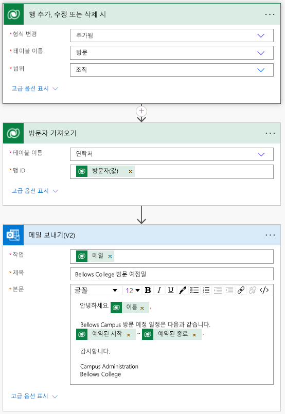

---
lab:
  title: '랩 4: 자동화된 솔루션 빌드 방법'
  module: 'Module 4: Get Started with Power Automate'
ms.openlocfilehash: 9b07c81fad82867bb54c2889687075fa7a463b81
ms.sourcegitcommit: 36c8fda9cdc6f448416d7000e38c1606bea87d2e
ms.translationtype: HT
ms.contentlocale: ko-KR
ms.lasthandoff: 05/07/2022
ms.locfileid: "144812949"
---
# 모듈 4: Power Automate 시작하기
## 랩: 자동화된 솔루션 빌드 방법

## 시나리오

Bellows College는 캠퍼스 내에 여러 건물이 있는 교육 기관입니다. 캠퍼스 방문자는 현재 종이 저널에 기록되어 있습니다. 이 정보는 일관되게 수집되지 않으며, 전체 캠퍼스 방문 데이터를 수집하고 분석할 방법이 없습니다.

캠퍼스 관리부는 건물 액세스가 보안 요원에 의해 제어되고, 모든 방문이 반드시 호스트에 의해 사전 등록 및 기록되는 현대화된 방문자 등록 시스템을 원합니다.

이 과정 전반에 걸쳐 벨로즈 칼리지 관리 및 보안 담당자가 캠퍼스 내 건물에 대한 액세스를 관리하고 제어할 수 있도록 애플리케이션을 빌드하고 자동화를 수행합니다.

이 랩에서는 방문이 예약될 때 방문자에게 이메일을 보낼 Power Automate 흐름을 만듭니다.

# 고급 랩 단계

프로젝트 완료를 위해 구현해야 하는 요구 사항은 다음과 같습니다.

-   방문이 예약된 경우 연락처에 전자 메일을 통해 알림을 받아야 합니다.

## 필수 조건

-   **모듈 0 랩 0 - 랩 환경 검증** 완료

-   **모듈 2 랩 1 - Microsoft Dataverse 소개** 완료

-   개인 메일 주소가 채워져 만든 John Do 연락처

# 연습 \#1: 방문 알림 흐름 만들기

**목표:** 이 연습에서는 요구 사항을 구현하는 Power Automate 흐름을 만듭니다. 방문자는 방문이 생성될 때 방문에 할당된 고유 코드가 포함된 이메일을 보내야 합니다.

## 작업 \#1: 흐름 만들기

1.  <https://make.powerapps.com>로 이동합니다. 다시 인증해야 할 수도 있습니다. **로그인** 을 클릭하고 필요한 경우 지침을 따르세요.

2.  아직 선택되지 않은 경우 오른쪽 상단에 있는 **[내 이니셜] 연습** 환경을 선택합니다.

2.  왼쪽 탐색 영역에서 **흐름** 을 선택합니다.

4.  메시지가 표시되면 **시작** 을 선택합니다.

5.  **새 흐름** 을 클릭하고 **자동화된 클라우드 흐름** 을 선택합니다.

6.  **흐름 이름** 에 "방문 알림"을 입력합니다.

7.  **흐름의 트리거 선택** 에서 **Dataverse** 를 검색합니다.

8.  **행을 추가, 수정 또는 삭제할 때** 트리거를 선택한 다음 **만들기** 를 클릭합니다.

9.  흐름에 대한 트리거 조건을 채웁니다.

    1.  **변경 유형** 에 대해 **추가됨** 을 선택합니다.

    2.  **테이블 이름** 에 대해 **방문** 을 선택합니다.

    3.  **범위** 에 대한 **조직** 선택

    4.  트리거 단계에서 줄임표( **...** )를 클릭하고 **이름 바꾸기** 를 클릭합니다.
        이 트리거의 이름을 **"방문이 추가될 때"** 로 바꿉니다. 이것은 좋은 연습이므로 사용자 및 기타 흐름 편집자는 세부 정보에 대해 자세히 살펴볼 필요 없이 이 단계의 목적을 이해할 수 있습니다.

## 작업 \#2: 방문자 행을 가져오는 단계 만들기

1.  **새 단계** 를 선택합니다. 이 단계는 전자 메일을 포함하여 방문자 정보를 검색하는 데 필요합니다.

2.  **Dataverse** 를 검색합니다.

3.  **ID 기준으로 행 가져오기** 작업을 선택합니다.

4.  **연락처** 를 **테이블 이름** 으로 선택합니다.

5.  **행 ID** 필드를 선택합니다. 동적 콘텐츠 또는 식을 선택하기 위한 창이 나타납니다. 

6.  **행 ID** 필드에서 동적 콘텐츠 목록의 **방문자(값)** 를 선택합니다. 이 단계에서는 이 흐름을 트리거하기 위해 만든 방문 행에 대한 연락처를 조회합니다. 전자 메일 주소는 연락처 테이블의 일부이므로 방문자에게 전자 메일을 보내려면 이 정보가 필요합니다. 

7.  이 작업에서 줄임표( **...** )를 클릭하고 **이름 바꾸기** 를 클릭합니다.
        이 작업의 이름을 **"방문자 받기"** 로 바꿉니다. 이것은 좋은 연습이므로 사용자 및 기타 흐름 편집자는 세부 정보에 대해 자세히 살펴볼 필요 없이 이 단계의 목적을 이해할 수 있습니다.

## 작업 \#3: 방문자에게 메일을 보내는 단계 만들기

1.  **새 단계** 를 클릭합니다. 이 단계는 방문자에게 전자 메일을 보내는 단계입니다.

2.  메일을 검색하고 **Office 365 Outlook** 커넥터를 선택한 다음 **이메일 보내기(V2)** 작업을 선택합니다.

3.  이 작업을 사용하기 위한 사용 약관을 수락하라는 메시지가 표시되면 **수락** 을 클릭합니다.

4.  **받는 사람** 필드 아래에서 **동적 콘텐츠 추가** 를 선택합니다. 
    
5.  동적 콘텐츠 목록에서 **메일** 을 선택합니다.
        > Notice that it is beneath the **Get the visitor** header. This means you
        are selecting the Email that is related to the Visitor that you looked
        up in the previous step.

6.  **벨로즈 대학 예약 방문** 을 **제목** 필드에 입력합니다.

7.  **전자 메일 본문** 에 다음 텍스트를 입력합니다.

>   필드가 괄호로 명명되는 곳에 동적 콘텐츠를 배치해야 합니다. 먼저 모든 텍스트를 복사하여 붙여넣은 다음 올바른 장소에 동적 콘텐츠를 추가하는 것이 좋습니다.

~~~~~~~~~~~~~~~~~~~~~~~~~~~~~~~~~~~~~~~~~~~~~~~~~~~~~~~~~~~~~~~~~~~~~~~~~~~~~~~~
   Dear {First Name},

   You are currently scheduled to visit Bellows Campus from {Scheduled Start} until {Scheduled End}.

   Best regards,

   Campus Administration
   Bellows College
~~~~~~~~~~~~~~~~~~~~~~~~~~~~~~~~~~~~~~~~~~~~~~~~~~~~~~~~~~~~~~~~~~~~~~~~~~~~~~~~

8.  **{First Name}** 텍스트를 강조 표시합니다. 이를 **방문자 가져오기** 단계의 **이름** 필드로 바꿉니다.

9.  **{Scheduled Start}** 텍스트를 강조 표시합니다. **예약된 시작** 필드 **방문이 추가될 때** 단계로 대체합니다.

10.  **{Scheduled End}** 텍스트를 강조 표시합니다. **방문이 추가될 때** 단계에서 **예약된 끝** 필드로 대체합니다.

11.  **저장** 을 클릭합니다.

다음 작업에 대해 이 흐름 탭을 열어 둡니다. 흐름은 대략 다음과 같아야 합니다.

## 작업 \#4: 흐름의 유효성 검사 및 테스트

1.  브라우저에서 새 탭을 열고 <https://make.powerapps.com>으로 이동합니다.

2.  아직 선택되지 않은 경우 오른쪽 상단에 있는 **[내 이니셜] 연습** 환경을 선택합니다.

3.  **앱** 을 클릭하여 앞서 만든 **캠퍼스 관리 모델 기반** 앱을 선택합니다.

3.  이 브라우저 탭을 열어 두고 흐름이 있는 이전 탭으로 다시 이동합니다.

4.  명령 모음에서 **테스트** 를 클릭합니다. **수동** 을 선택한 다음 **테스트** 를 클릭합니다.

5.  모델 기반 앱이 열려 있는 브라우저 탭으로 이동합니다. 

6.  왼쪽의 탐색 영역에서 **방문** 을 선택합니다.

6. **+ 새로 만들기** 단추를 눌러 새 **방문** 레코드를 추가합니다.

7. 다음과 같이 방문 레코드를 완성합니다.

    -   **이름:** 테스트 방문

    -   **방문자:** John Doe

    -   **예약된 시작:** 내일 오전 8:00

    -   **예약된 종료:** 내일 오전 9:00

8. **저장 후 닫기** 단추를 선택합니다.

9. 흐름 테스트가 실행되는 브라우저 탭으로 이동합니다. 잠시 후 흐름 실행을 볼 수 있습니다. 여기에서 흐름의 문제를 확인하거나 성공적으로 실행되었는지 확인할 수 있습니다. 

John Doe의 메일을 개인 메일로 입력했기 때문에 조금 후에 받은 편지함에 메일이 도착합니다. 정크 메일 폴더로 이동될 수 있습니다.

# 과제

-   메일에 서식을 지정합니다. 어떻게 하면 좀 더 전문적으로 보이게 할 수 있을까요? 
