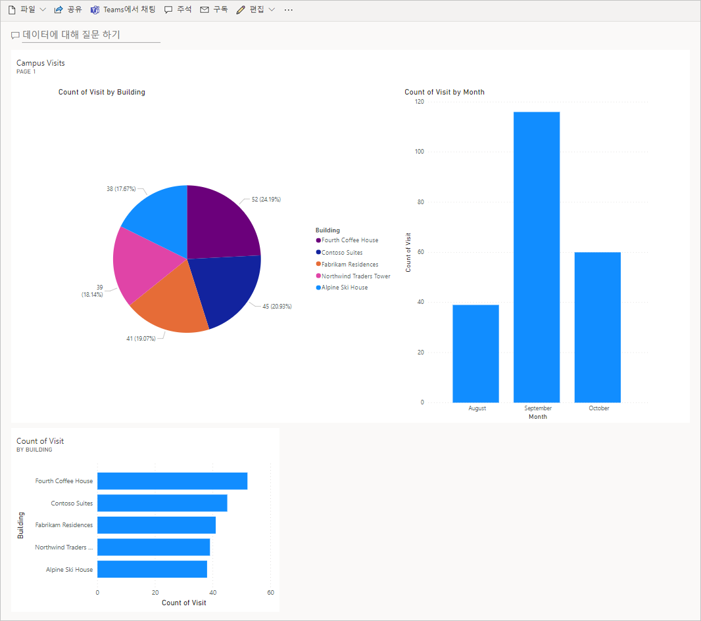

---
lab:
  title: '랩 5: 간단한 대시보드를 빌드하는 방법'
  module: 'Module 5: Get Started with Power BI'
---

## 랩 5: 간단한 대시보드를 빌드하는 방법

**WWL 테넌트 - 사용 약관** 강사 진행 교육에서 사용할 수 있도록 제공되는 테넌트는 해당 강사 진행 교육의 실습 랩 지원용으로 제공되는 것이므로 테넌트를 실습 랩 외부에서 공유하거나 사용해서는 안 됩니다. 이 과정에서 사용되는 테넌트는 평가판 테넌트이며 클래스가 종료된 후 사용하거나 액세스할 수 없으며 확장판에서도 사용할 수 없습니다. 테넌트를 유료 구독으로 변환해서는 안 됩니다. 이 과정의 일부로 얻은 테넌트는 Microsoft Corporation의 재산으로 유지되며 언제든지 액세스 권한을 획득하고 다시 소유할 수 있는 권리를 보유합니다. 

## 시나리오

Bellows College는 캠퍼스 내에 여러 건물이 있는 교육 기관입니다. 캠퍼스 방문자는 현재 종이 저널에 기록되어 있습니다. 이 정보는 일관되게 수집되지 않으며, 전체 캠퍼스 방문 데이터를 수집하고 분석할 방법이 없습니다.

캠퍼스 관리부는 건물 액세스가 보안 요원에 의해 제어되고, 모든 방문이 반드시 호스트에 의해 사전 등록 및 기록되는 현대화된 방문자 등록 시스템을 원합니다.

이 과정 전반에 걸쳐 Bellows College 관리 및 보안 담당자가 캠퍼스 내 건물에 대한 액세스를 관리하고 제어할 수 있도록 애플리케이션을 빌드하고 자동화를 수행합니다.

이 랩에서는 캠퍼스 방문에 대한 데이터를 시각화하는 Power BI 보고서 및 대시보드를 빌드합니다.

## 랩 단계 요약

Power BI 대시보드를 디자인하고 만들기 위해 아래 단계를 따릅니다.

-   캠퍼스 방문 정보에 대한 다양한 시각화가 포함된 보고서 만들기

-   추가 시각화를 빌드하는 사용자 자연어 쿼리 활용

## 필수 조건

- **모듈 0 랩 0 - 랩 환경 검증** 완료
- **모듈 2 랩 1 - 데이터 모델링** 완료

## 시작하기 전에 고려해야 할 사항

-   보고서의 대상 그룹은 누구입니까?
-   대상 그룹은 보고서를 어떻게 소비합니까? 일반적인 디바이스는 무엇인가요? 위치는 어디인가요?
-   시각화할 데이터가 충분합니까?
-   방문 데이터를 분석하는 데 사용 가능한 특징은 무엇입니까?

## 연습 1: Power BI 보고서 만들기

**목표:** 이 연습에서는 앞선 연습에서 활용했던 Excel 스프레드시트 데이터를 기준으로 Power BI 보고서를 만듭니다.

### 작업 \#1: Power BI 서비스 준비

1.  visits.pbix 파일은 가상 머신 바탕 화면의 AllFiles 폴더에 저장되어 있습니다. 바탕 화면에 [visits.pbix](https://github.com/MicrosoftLearning/PL-900-Microsoft-Power-Platform-Fundamentals/raw/master/Allfiles/visits.pbix) 파일이 없으면 해당 파일을 다운로드하여 컴퓨터에 저장합니다.

2.  필요한 경우 새 탭을 열고 `https://app.powerbi.com`으로 이동하여 로그인합니다.

3.  왼쪽 탐색 영역에서 **내 작업 영역**을 선택합니다.

5.  **업로드**를 선택한 다음, **찾아보기**를 선택합니다.

6.  이전에 다운로드한 **visits.pbix** 파일을 찾아 선택합니다. 

7.  데이터 로드가 완료되면 **방문** 보고서를 선택합니다.

    > **참고:** 형식이 **보고서**로 설정되어 있으므로 데이터 세트를 선택하지 마세요.

8.  **편집**을 선택합니다. 

    **편집** 메뉴 항목이 표시되지 않으면 줄임표 **…** 를 선택한 다음, **편집**을 선택합니다.

이제 랩에 사용할 Power BI 서비스를 설정했습니다.

### 작업 \#2: 차트 및 시간 시각화를 만듭니다

1.  **시각화** 패널에서 **원형 차트** 아이콘을 선택하여 차트를 삽입합니다.

2.  **필드** 창에서 **bc_Visit**을 확장합니다. **건물** 필드를 끌어서 **범례** 상자에 놓습니다.

3.  **방문** 필드를 끌어서 **값** 상자에 놓습니다.

4.  모든 차트 구성 요소가 표시되도록 코너 핸들을 사용하여 원형 차트의 크기를 조정합니다.

5.  원형 차트 외부의 보고서를 클릭하여 선택을 취소하고 **시각화** 창에서 **누적 세로 막대형 차트** 아이콘을 선택합니다.

6.  **필드** 창에서 **bc_Visit**가 아직 확장되어 있지 않으면 확장합니다. **방문** 필드를 끌어서 **Y축** 상자에 놓습니다.

7.  **시작** 필드를 끌어서 **X축** 상자에 놓습니다.

8.  **시각화** 창에서 **연도** 및 **분기** 옆의 **x**를 선택하여 X축의 **월** 및 **일** 합계만 남겨둡니다.

9.  모서리 핸들을 사용하여 필요에 따라 차트 크기를 조정합니다.

10. 보고서 상호 작용 테스트:

    1.  원형 차트의 다른 빌드 슬라이스를 선택하여 누적 세로 막대형 차트의 변경 내용을 살펴봅니다.

    2.  누적 세로 막대형 차트를 선택합니다. 위쪽 화살표를 선택하여 차트를 **드릴업**합니다. 아래쪽 화살표를 선택하여 **드릴다운** 모드를 켜고 열을 선택하여 다음 단계(일)로 드릴다운합니다.

    3.  드릴업 및 드릴다운 후 누적 세로 막대형 차트에서 다양한 막대를 선택하여 원형 보고서의 변경 내용을 살펴봅니다.

11. **이 보고서 저장**을 선택하여 진행 중인 작업을 저장합니다.

## 연습 2: Power BI 대시보드 만들기

### 작업 \#1: Power BI 대시보드 만들기

1.  이전 작업의 보고서가 열려있습니다.

2.  메뉴에서 **대시보드에 고정**을 선택합니다. 레이아웃에 따라 더 많은 옵션을 표시하려면 줄임표 메뉴 **...** 를 선택해야 할 수도 있습니다.

3.  **대시보드에 고정** 프롬프트에서 **새 대시보드**를 선택합니다.

4.  **대시보드 이름**으로 `Campus Management`을 입력하고 **라이브 고정**을 선택합니다.

5.  대시보드가 만들어졌는지 묻는 팝업 메시지가 표시됩니다. **대시보드로 이동**을 선택합니다.

6.  표시된 원형 및 막대형 차트의 대화형 작업을 테스트합니다.

### 작업 \#2: 자연어를 사용하여 시각화 추가

1.  **캠퍼스 관리** 대시보드 내에서 맨 위에 있는 **데이터에 대해 질문하기**를 선택합니다.

2.  Q&A 영역에 `buildings by number of visits`을 입력합니다. 막대형 차트가 표시됩니다.

3.  **시각적 개체 고정**을 선택합니다.

4.  **기존 대시보드**, **캠퍼스 관리** 대시보드, **고정**을 차례로 선택합니다.

5.  **Q&A 종료**를 선택합니다.

**캠퍼스 관리** 대시보드에는 세 개의 시각적 개체가 표시되어야 합니다. 새 Q&A 시각적 개체를 보려면 아래로 스크롤해야 할 수 있습니다.

대시 보드는 다음과 유사해야 합니다.

